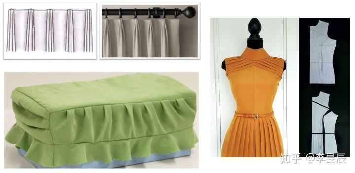
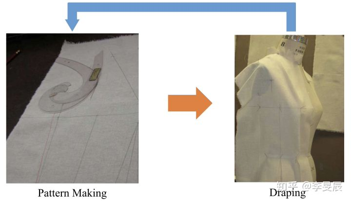
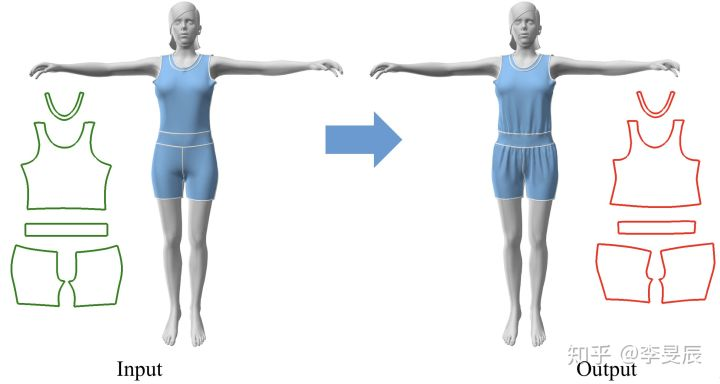
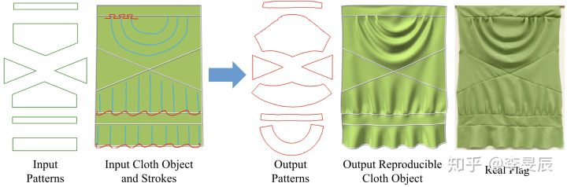
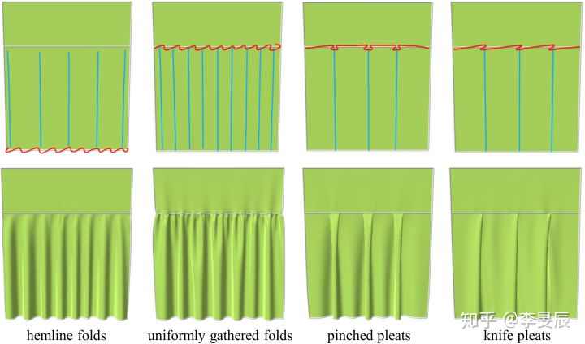

# Homework 1

`16340237_吴聪_HW1_v0`

[TOC]

##  Basic: 

> 回答下面的问题：

### 1. 结合上述参考链接（或其他参考资料），谈谈自己对计算机图形学的理解。

听完高老师第一节课关于计算机图形学的 Introduction 以及看完作业 Reference 中刘利刚老师的《什么是计算机图形学》后，我对计算机图形学有了一些基本的理解：

* 计算机图形学的定义：由于计算机图形学与很多学科都有交叉，因此要对计算机图形学进行严格的定义是困难的。“ Wiki 百科”和“百度百科”给出的定义是：**计算机图形学是一种使用数学算法将二维或三维图形转化为计算机显示器的栅格形式的科学。**而在今天看来，这样的定义显然是**狭义**的，现在的计算机图形学研究的范围研究非常广泛了。但就这门入门课程而言，这种狭义的定义已经足够。
* 计算机图形学的内容：**计算机图形学主要包含四大部分的内容：建模 (Modeling) 、渲染 (Rendering) 、动画 (Animation) 和人机交互 (Human-Computer Interaction, HCI)。**我们很容易把这四部分内容串联起来：要在计算机中表示一个三维物体，首先要有它的集合模型表达，这需要建模；有了三维模型，下一步我们就要尽可能真实地把这些三维模型画出来，这需要渲染；如果我们希望能够让静态的图像运动起来，让场景中的三维物体能够相互作用，我们就需要动画，来让我们的计算机图形学动起来，变得更加有趣；而在人机交互越来越受到重视的今天，我们显然需要研究人机交互来帮助我们更好地建模，与图形互动等等，人机交互的发展带给了计算机图形学领域更多的探索。
* 个人看法：计算机图形学四大部分的内容无一不在追求一种“真实感”，建模要高精度，渲染要高真实，动画要高度模拟物理真实感和各种运动，人机交互一部分也是要我们更加沉浸，对真实感的追求无疑是一直以来计算机图形学的方向，同时也是动力。当然，除了真实地模拟现实，计算机图形学还能够用来真实地模拟我们的想象，把那些现实中无法实现的梦用图形学画出来，这也是计算机图形学的另一种魅力吧。

### 2. 结合上述参考链接（或其他参考资料），回答什么是 OpenGL ?  OpenGL ES ? Web GL ? Vulkan ? DirectX ? 

* **OpenGL**

  OpenGL 一般被认为是一个 API (Application Programming Interface，应用程序编程接口)，包含了一系列可以操作图像、图像的函数。然而，**OpenGL 本身并不是一个 API，它仅仅是一个由 [Khronos 组织](http://www.khronos.org/)制定并维护的规范 (Specification)**。

  **OpenGL 规范严格规定了每个函数应该如何执行，以及它们的输出值。至于内部具体每个函数是如何实现 (Implement)的，将由 OpenGL 库的开发者自行决定，也即具体的 OpenGL 库允许使用不同的实现。**任何时候 OpenGL 库表现的行为与规范规定的不一致时，基本都是库的开发者留下的 bug。

  OpenGL 大多数实现是由显卡产商编写的，**当产生一个 bug 时通常可以通过升级显卡驱动来解决**。这些驱动会包括你的显卡能支持的最新版本的 OpenGL。

* **OpenGL ES**

  **OpenGL ES (OpenGL for Embedded Systems) 是 OpenGL 三维图形 API 的子集，针对手机、PDA 和游戏主机等嵌入式设备而设计。**该 API 由 Khronos 集团定义推广。

  **OpenGL ES 是从 OpenGL 裁剪定制而来的**，去除了 glBegin/glEnd，四边形 (GL_QUADS)、多边形 (GL_POLYGONS)等复杂图元等许多非绝对必要的特性。经过多年发展，现在主要有两个版本， OpenGL ES 1.x 针对固定管线硬件的，OpenGL ES 2.x 针对可编程管线硬件。

* **Web GL**

  WebGL 是一种 3D 绘图标准，这种绘图技术标准允许把 JavaScript 和 OpenGL ES 2.0 结合在一起，通过增加 OpenGL ES 2.0 的一个 JavaScript 绑定，WebGL 可以为 HTML5 Canvas 提供硬件 3D 加速渲染，这样 Web 开发人员就可以借助系统显卡来在浏览器里更流畅地展示 3D 场景和模型了，还能创建复杂的导航和数据视觉化。

  显然，WebGL 技术标准免去了开发网页专用渲染插件的麻烦，可被用于创建具有复杂 3D 结构的网站页面，甚至可以用来设计 3D 网页游戏等等。

* **Vulkan**

  Vulkan 是 Khronos 组织制定的“下一代”开放的图形显示 API，是与 DirectX12 能够匹敌的 GPU API 标准。Vulkan 是基于 AMD 的 Mantle API 演化而来， Vulkan 提供了能直接控制和访问底层 GPU 的显示驱动抽象层。显示驱动仅仅是对硬件薄薄的封装，这样能够显著提升操作 GPU 硬件的效率和性能。Vulkan 不再使用 OpenGL 的状态机设计，内部也不保存全局状态变量。显示资源全然由应用层负责管理，包括内存管理、线程管理、多线程绘制命令产生以及渲染队列提交等等。应用程序能够充分利用 CPU 的多核多线程的计算资源，降低 CPU 等待，降低延迟。带来的问题是，线程间的同步问题也由应用程序负责，从而对开发人员的要求也更高。

* **DirectX**

  DirectX 是由微软公司创建的一系列专为多媒体以及游戏开发的应用程序接口。由 C++ 编程语言实现，遵循 COM 架构。DirectX 被广泛用于 Microsoft Windows、Microsoft XBOX、Microsoft XBOX360 和 Microsoft XBOX ONE 电子游戏开发，并且只能支持这些平台。除了游戏开发之外，DirectX 亦被用于开发许多虚拟三维图形相关软件，比如 Direct3D 是 DirectX 中最广为应用的子模块。

### 3. `gl.h` `glu.h` `glew.h` 的作用分别是什么? 

* `gl.h`

  OpenGL 中的 gl 是核心库，包含有 115 个函数，函数名的前缀为 gl。这部分函数用于常规的，核心的图形处理。

* `glu.h`

  OpenGL 中的 glu 是实用库，包含了 43 个函数，函数名的前缀为 glu。OpenGL 提供了强大的但是为数不多的绘图命令，所有较复杂的绘图都必须从点、线和面开始。为了减轻繁重的编程工作，glu 部分封装了 OpenGL 函数，glu 函数通过调用核心库的函数，为开发者提供相对简单的用法，实现一些较为复杂的操作。

* `glew.h`

  glew 是一个跨平台的 C++ 扩展库，它基于 OpenGL 图像接口。glew 主要用来提供高版本 gl 函数的支持，OpenGL 只是一个标准/ 规范，具体的实现是由驱动开发商是针对特定显卡实现的，由于 OpenGL 驱动版本多，所以 OpenGL 大多数函数的位置都无法在编译时确定下来，需要在运行时查询（手写函数指针来判断各个 OpenGL 高版本函数是否支持）。而 glew 能够自动识别你的平台所支持的 OpenGL 全部高级扩展函数，使开发人员可以像使用原生函数一样随意调用 OpenGL 各个版本的函数。

### 4. 使用 GLFW 和 freeglut 的目的是什么？ 

在我们画出出色的效果之前，**我们首先要做的就是创建一个 OpenGL上下文 (Context) 和一个用于显示的窗口。**然而，**创建 OpenGL 上下文以及创建显示窗口的操作在不同的系统上是不一样的，OpenGL考虑到这一点，有目的地把这些操作从自身抽象出去。**这意味着我们不得不自己处理创建串口，定义 OpenGL 上下文以及处理用户输入。

幸运的是，有一些库已经提供了我们所需要的功能，其中一部分就是特别针对 OpenGL 的（比如GLFW 和 freeglut）。我们使用 GLFW 和 freeglut 就能够节省我们书写操作系统相关代码的时间，**让这些库帮我们创建 OpenGL 上下文，创建一个线上窗口以及处理用户输入，且使用 GLFW 和 freeglut 还能保证跨平台性**。

### 5. 结合上述参考链接（或其他参考资料），选择一个 SIGGRAPH 2017/2018 上你最喜欢的专题，介绍该专题是做什么的，使用了什么 CG 技术？（不少于 100 字）

我选择的喜欢的专题是在 SIGGRAPH 2018 上提出的  [FoldSketch Li et al. 2018\]](http://link.zhihu.com/?target=http%3A//www.cs.ubc.ca/labs/imager/tr/2018/FoldSketch/)，该专题**提出了一个基于草图的褶设计方法，然后借用了布料模拟来保证输出服装及其制版的物理合理性，简化了传统服装设计流水线中制版和垂衣的过程**。

在服装设计领域，褶是十分常用的一种元素，它能为衣物增添细节与趣味。

然而在传统的服装设计流水线与目前现有的[制版模拟软件](https://zhuanlan.zhihu.com/p/29620024)（如 Marvelous Designer、Browzwear 等）中，服装设计师需要反复不断地更改制版、垂衣，才能在最终的垂衣试验中得到所需的效果。

这个过程要求有很丰富的制版专业知识，即精通如何将三维立体垂衣时所需的修改，转变为在平面制版上的修改。同时，这个过程也是相当耗时、耗材的。

FoldSketch 是首个让褶的设计变得简便高效的系统，它省去了繁杂的制版和垂衣过程。

使用 FoldSketch，用户只需将所设计的褶用草图的形式勾勒在初始的 3D 衣物上，就能直接得到添加褶后的 3D 衣物以及其制版。这个制版是根据物理布料模拟得到的，从而保证了在现实场景中进行衣物制作的适用性。

FoldSketch 让用户使用两类线条来描述他们的设计理念，即描述褶的大小以及类型的 “gathering stroke”（下图红色），以及描述位置、方向、频率的 “path strokes”（下图蓝色）。

在服装设计领域，服装设计师一般都是使用草图（sketch）的形式去表达自己的设计理念的，也正因如此，对于基于草图（sketch）的 3D 服装建模的研究非常火热，早在 2006 年就已经有基于草图来建模 3D 衣服并生成制版的工作的尝试，但到现在，要设计细节丰富的服装依旧还是很难的，比如褶（Fold/Pleat）的设计，如何更方便更准确地进行建模，FoldSketch 给出了一个不错的方向。

个人觉得该专题主要用到了 CG 里大量的建模技术，不仅仅是上面提到的**基于笔划或草图交互方式的三维建模方法**，还有**计算机辅助设计的建模方法**（服装设计 CAD 的趋势还是非常明显的），除了对设计细节丰富的服装建模以外，FoldSketch 中的**布料模拟，各种物理形变，碰撞**也是非常有用的 CG 技术，帮助我们能够更好地模拟出垂衣的结果，减少了现实设计过程中时间和材料的耗费。

参考链接：

* [迈向人工智能Fashion Design（一）- 服装制版模拟](https://zhuanlan.zhihu.com/p/29620024)
* [迈向人工智能Fashion Design（二）- 模块化服装设计](https://zhuanlan.zhihu.com/p/31715910)
* [【SIGGRAPH 2018】FoldSketch](https://zhuanlan.zhihu.com/p/27609442)
