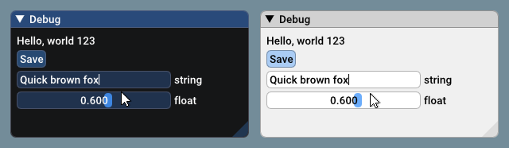
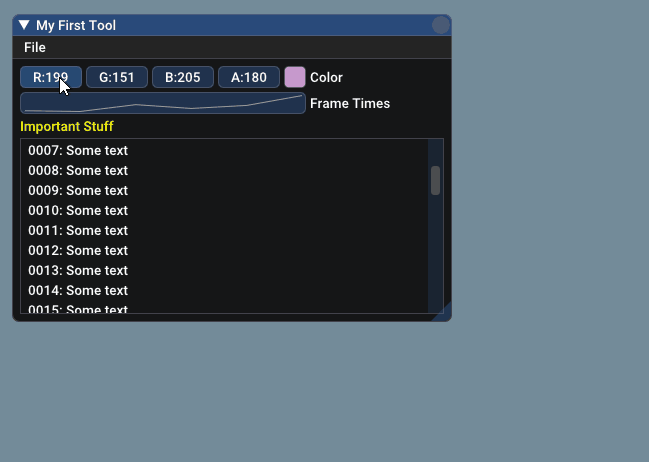
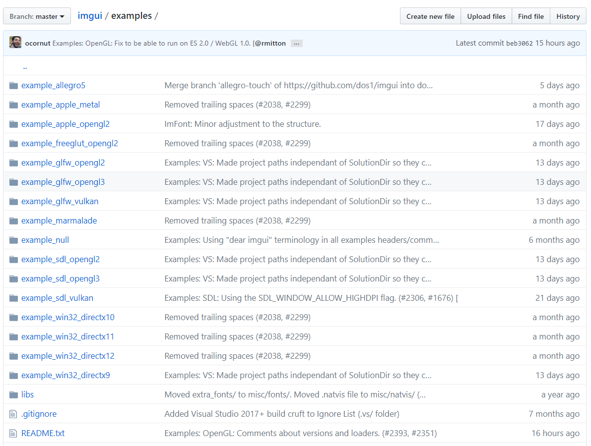

# Homework 2 Prepare


## imgui 上手

### installation

> imgui 源代码

Dear ImGui is **self-contained within a few files** that you can easily **copy and compile into your application/engine**:

- imgui.cpp
- imgui.h
- imgui_demo.cpp
- imgui_draw.cpp
- imgui_widgets.cpp
- imgui_internal.h
- imconfig.h (empty by default, user-editable)
- imstb_rectpack.h
- imstb_textedit.h
- imstb_truetype.h

### Usage

> 基本的使用，关于 imgui 的更多丰富的使用和特性可以参考 `imgui_demo.cpp` 代码

Your code passes mouse/keyboard/gamepad inputs and settings to Dear ImGui (see example applications for more details). After Dear ImGui is setup, you can use it from _anywhere_ in your program loop:

Code:

```c++
ImGui::Text("Hello, world %d", 123);
if (ImGui::Button("Save"))
{
    // do stuff
}
ImGui::InputText("string", buf, IM_ARRAYSIZE(buf));
ImGui::SliderFloat("float", &f, 0.0f, 1.0f);
```

Result:



​		*(settings: Dark style (left), Light style (right) / Font: Roboto-Medium, 16px / Rounding: 5)*

Code:

```c++
// Create a window called "My First Tool", with a menu bar.
ImGui::Begin("My First Tool", &my_tool_active, ImGuiWindowFlags_MenuBar);
if (ImGui::BeginMenuBar())
{
    if (ImGui::BeginMenu("File"))
    {
        if (ImGui::MenuItem("Open..", "Ctrl+O")) { /* Do stuff */ }
        if (ImGui::MenuItem("Save", "Ctrl+S"))   { /* Do stuff */ }
        if (ImGui::MenuItem("Close", "Ctrl+W"))  { my_tool_active = false; }
        ImGui::EndMenu();
    }
    ImGui::EndMenuBar();
}

// Edit a color (stored as ~4 floats)
ImGui::ColorEdit4("Color", my_color);

// Plot some values
const float my_values[] = { 0.2f, 0.1f, 1.0f, 0.5f, 0.9f, 2.2f };
ImGui::PlotLines("Frame Times", my_values, IM_ARRAYSIZE(my_values));

// Display contents in a scrolling region
ImGui::TextColored(ImVec4(1,1,0,1), "Important Stuff");
ImGui::BeginChild("Scrolling");
for (int n = 0; n < 50; n++)
    ImGui::Text("%04d: Some text", n);
ImGui::EndChild();
ImGui::End();
```

Result:



### Useful Information

> examples/ 文件夹里给出了将 imgui 集成到自身引用程序的样例

* **Refer to the sample applications in the examples/ folder for instructions on how to integrate dear imgui with your existing codebase.**

  

### Demo Binaries

> 官方提供的 imgui-demo，展示了诸多 imgui 的 特性和用法

You should be able to build the examples from sources (tested on Windows/Mac/Linux). If you don't, let me know! **If you want to have a quick look at some Dear ImGui features, you can download Windows binaries of the demo app here**:

- [imgui-demo-binaries-20190219.zip](http://www.dearimgui.org/binaries/imgui-demo-binaries-20190219.zip) (Windows binaries, Dear ImGui 1.68 built 2019/02/19, master branch, 5 executables)

The demo applications are unfortunately not yet DPI aware so expect some blurriness on a 4K screen. For DPI awareness in your application, you can load/reload your font at different scale, and scale your Style with `style.ScaleAllSizes()`.

### Bindings

> imgui 第三方绑定代码，用于将 imgui 集成到自身代码环境（OpenGL3 + GLFW）上

Integrating Dear ImGui within your custom engine is a matter of 1) wiring mouse/keyboard/gamepad inputs 2) uploading one texture to your GPU/render engine 3) providing a render function that can bind textures and render textured triangles. **The [examples/](https://github.com/ocornut/imgui/tree/master/examples) folder is populated with applications doing just that.** If you are an experienced programmer at ease with those concepts, it should take you about an hour to integrate Dear ImGui in your custom engine. Make sure to spend time reading the FAQ, the comments and other documentation!

Frameworks:

- Renderers: DirectX 9/10/11/12, Metal, OpenGL2, OpenGL3+/ES2/ES3, Vulkan: [examples/](https://github.com/ocornut/imgui/tree/master/examples)
- Platform: GLFW, SDL, Win32, OSX, Freeglut: [examples/](https://github.com/ocornut/imgui/tree/master/examples)

### Support

> imgui 论坛

If you are new to Dear ImGui and have issues with: compiling, linking, adding fonts, wiring inputs, running or displaying Dear ImGui: please post on the Discourse forums: [https://discourse.dearimgui.org](https://discourse.dearimgui.org/).

### Frequently Asked Question (FAQ)

> 常见的问题及解答

**Where is the documentation?**

- **The documentation is at the top of imgui.cpp + effectively imgui.h.**
- **Example code is in imgui_demo.cpp and particularly the ImGui::ShowDemoWindow() function. It covers most features of ImGui so you can read the code and call the function itself to see its output.**
- **Standalone example applications using e.g. OpenGL/DirectX are provided in the examples/ folder.**

**How can I tell whether to dispatch mouse/keyboard to imgui or to my application?** 
**How can I display an image? What is ImTextureID, how does it works?** 
**How can I have multiple widgets with the same label or with an empty label? A primer on labels and the ID Stack.** 
**How can I use my own math types instead of ImVec2/ImVec4?** 
**How can I load a different font than the default?** 
**How can I easily use icons in my application?** 
**How can I load multiple fonts?** 
**How can I display and input non-latin characters such as Chinese, Japanese, Korean, Cyrillic?** ([example](https://github.com/ocornut/imgui/wiki/Loading-Font-Example)) 
**How can I interact with standard C++ types (such as std::string and std::vector)?** 
**How can I use the drawing facilities without an Dear ImGui window? (using ImDrawList API)** 
**How can I use this without a mouse, without a keyboard or without a screen? (gamepad, input share, remote display)** 
**I integrated Dear ImGui in my engine and the text or lines are blurry..** 
**I integrated Dear ImGui in my engine and some elements are disappearing when I move windows around..** 
**How can I help?**

<font color=red>**See the FAQ in imgui.cpp for answers.**</font>

---

> How to get started？

* 需要 copy 到程序中的代码：
  * imgui 源代码（创建 `imgui` 文件夹）：
    * imgui.cpp
    * imgui.h
    * imgui_demo.cpp
    * imgui_draw.cpp
    * imgui_widgets.cpp
    * imgui_internal.h
    * imconfig.h (empty by default, user-editable)
    * imstb_rectpack.h
    * imstb_textedit.h
    * imstb_truetype.h
  * imgui 第三方绑定
    * imgui_impl_glfw.h
    * imgui_impl_glfw.cpp
    * imgui_impl_opengl3.h
    * imgui_impl_opengl3.cpp
* 阅读 `examples/` 目录下的 `README.txt`
* 阅读 `imgui.h` 以及 `imgui.cpp`（Documentation 在 `imgui.cpp` 文件中，里面包含了 FAQ 的多个问题解答）
* 参考 `examples/example_glfw_opengl3` ，研究其中的 `main.cpp`（给出了 imgui 使用基本实例）
* 掌握 Usage（基本使用）

* More？

  * 阅读 `imgui_demo.cpp` ：**ImGui::ShowDemoWindow() function**。比对官方给出的 demo（也可以自己运行 `ShowDemoWindow()` 函数）了解 imgui 的更多特性使用效果及其实现

> 阅后总结

* 掌握 Usage 以及 `examples/example_glfw_opengl3/main.cpp` 中的内容基本就已足够 
* 更详细丰富的特性和用法可阅读 `imgui_demo.cpp`


---

> 对比往年师兄的 HW2 

* 往年师兄做作业时，imgui 只有 9 个 `.h/.cpp` 文件，少了 `imgui_widgets.cpp`

* 第三方库 bindings 时，当时把 opengl3 和 glfw 整合在一起：

  * `imgui_impl_glfw_gl3.cpp` + `imgui_impl_glfw_gl3.h`

  现在是分离的，所以在将 imgui 集成到自己的程序中去时，要添加更多的文件：

  * `imgui_impl_glfw.h` + `imgui_impl_glfw.cpp` + `imgui_impl_opengl3.h` + `imgui_impl_opengl3.cpp`


## 资料收集

* [GLFW（规范）](https://www.jianshu.com/p/d2b3db8cd2e5)：给出了相比 LearnOpenGL 而言更加具体的 GLFW 使用规范


