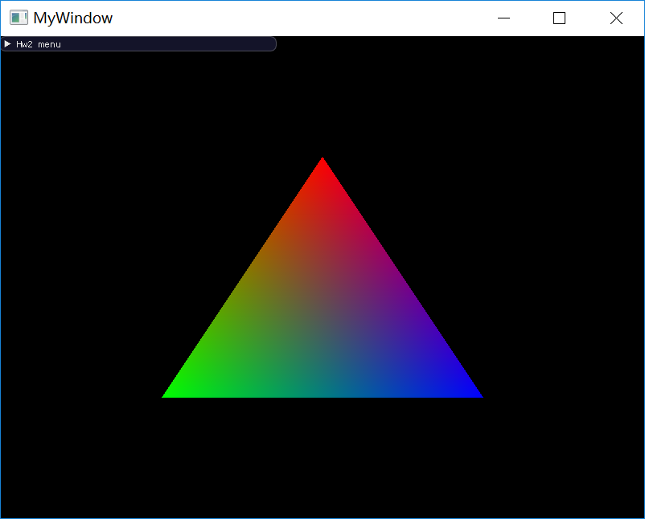
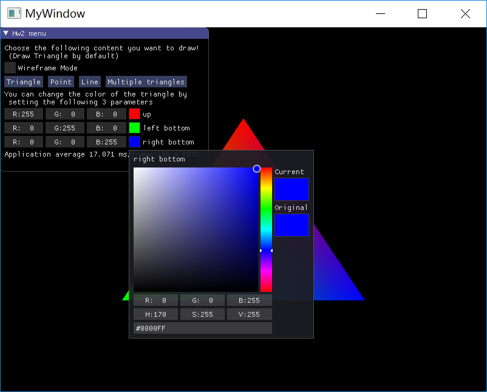
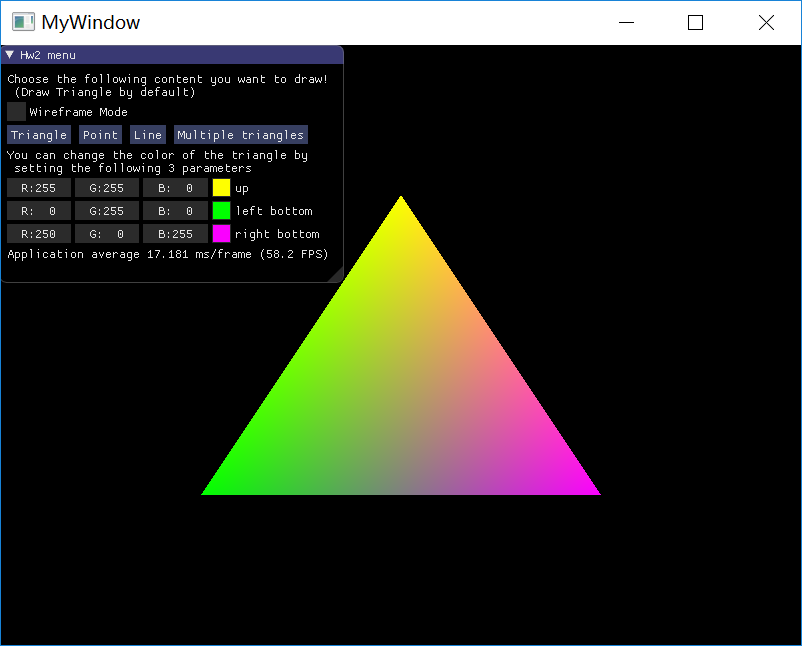
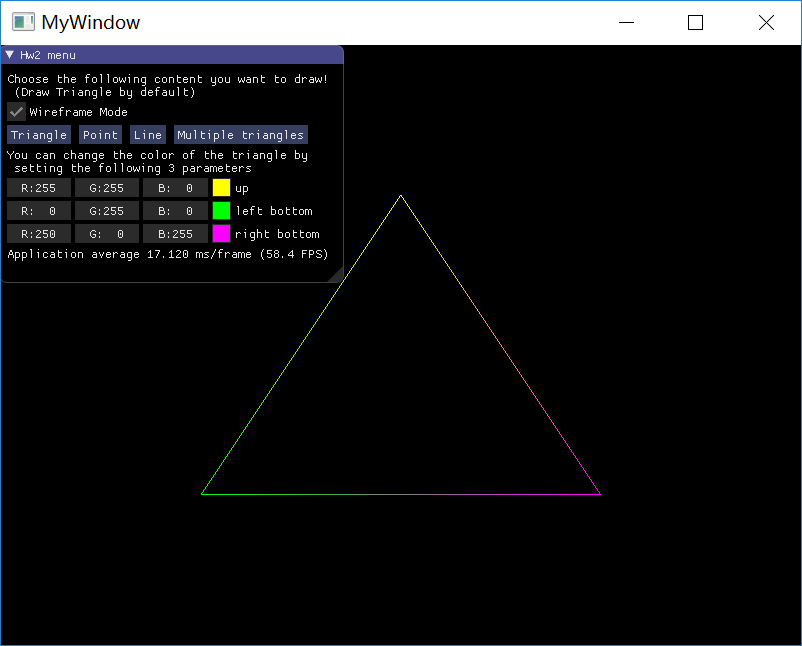
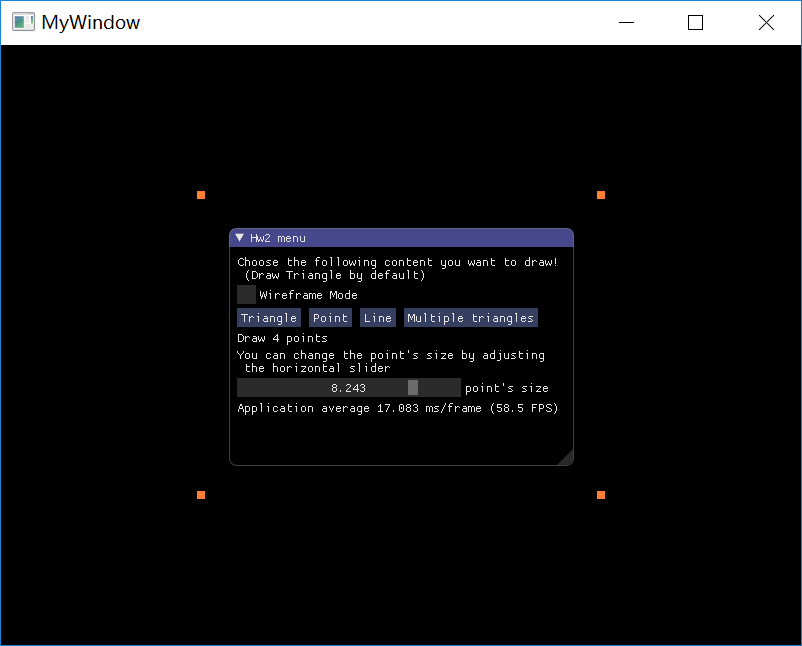
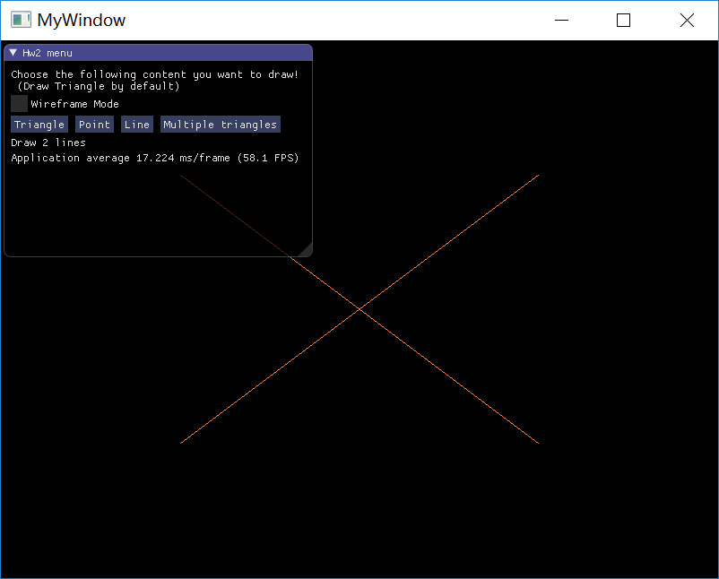
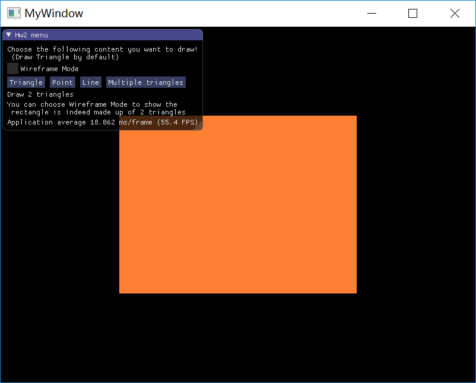
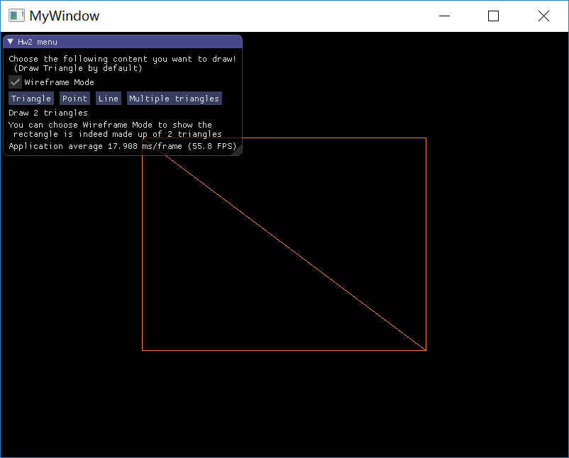

# Homework 2 - GUI and Draw simple graphics

`16340237_吴聪_HW2_v0`

[TOC]

## Basic

### 1.使用 OpenGL (3.3 及以上) + GLFW 或 freeglut 画一个简单的三角形。 

> 具体实现参考：[LearnOpenGL 你好，三角形](https://learnopengl-cn.github.io/01%20Getting%20started/04%20Hello%20Triangle/) 

**实现思路**

* 顶点输入的提供：给出所要绘制的三角形的三个顶点的位置信息
* 使用 VBO 管理顶点数据（把顶点输入发送到 GPU）
* 顶点着色器和片段着色器的编码和编译，并将这两个着色器链接为一个着色器程序对象
* 配置顶点属性指针来告诉 OpenGL 如何解释内存中的顶点数据
* 使用 VAO 来将 VBO 和对 VBO 所管理的顶点数据的解释（也即针对 VBO 的顶点属性配置）绑定在一起，避免在绘制多个物体时需要反复对不同 VBO 的相应顶点数据作重新配置（OpenGL 核心模式要求我们使用 VAO）
* 在渲染循环中进行渲染

### 2.对三角形的三个顶点分别改为红绿蓝，像下面这样。并解释为什么会出现这样的结果。

> 具体实现参考：[LearnOpenGL 着色器](https://learnopengl-cn.github.io/01%20Getting%20started/05%20Shaders/)

**实现思路**

在上述教程中，为了对三角形的三个顶点分别改为红绿蓝，教程为三角形添加了顶点属性：颜色，这种情况下顶点输入的每个顶点其数据包含了顶点位置信息和顶点颜色信息。

在自己的实现中，由于想做到在后续任务中能够做出修改三角形顶点颜色的效果，所以尝试了另外的方法。

想要修改顶点数据为指定的颜色，本质上是要向顶点颜色器传递相应顶点的颜色信息，这当然可以通过在顶点输入配置一个颜色属性来实现，此外我们也可以通过使用 uniform 来实现。

```
#version 330 core

layout (location = 0) in vec3 aPos;

out vec4 vertexColor;

uniform vec4 up_vertex_color;
uniform vec4 left_bottom_vertex_color;
uniform vec4 right_bottom_vertex_color;

void main()
{
	gl_Position = vec4(aPos, 1.0);
	if (aPos == vec3(0.0f, 0.5f, 0.0f))
		vertexColor = up_vertex_color;
	else if (aPos == vec3(-0.5f, -0.5f, 0.0f))
		vertexColor = left_bottom_vertex_color;
	else if (aPos == vec3(0.5f, -0.5f, 0.0f))
		vertexColor = right_bottom_vertex_color;
}
```

修改顶点着色器如上，我们向顶点着色器传递了 3 个颜色信息，根据对应的位置将颜色分配到对应的顶点。在 OpenGL 中片段着色器完成对片段的上色工作，所以我们需要将相应顶点的颜色信息从顶点着色器传递到片段着色器中去，这通过在顶点着色器声明一个 `out vec4 vertexColor` 和在片段着色器声明一个 `in vec4 vertexColor` 来完成。对于同类型同名变量，在着色器程序链接阶段 OpenGL 会把这些变量链接到一起。

---

**实现效果**



---

**对结果的解释**

实际上，[LearnOpenGL 着色器](https://learnopengl-cn.github.io/01%20Getting%20started/05%20Shaders/) 已经给出了详细的解释，如下：

> 这个图片可能不是你所期望的那种，因为我们只提供了3个颜色，而不是我们现在看到的大调色板。这是在片段着色器中进行的所谓<font color=green>片段插值</font>(Fragment Interpolation)的结果。当渲染一个三角形时，光栅化(Rasterization)阶段通常会造成比原指定顶点更多的片段。光栅会根据每个片段在三角形形状上所处相对位置决定这些片段的位置。
> 基于这些位置，它会<font color=green>插值</font>(Interpolate)所有片段着色器的输入变量。比如说，我们有一个线段，上面的端点是绿色的，下面的端点是蓝色的。如果一个片段着色器在线段的70%的位置运行，它的颜色输入属性就会是一个绿色和蓝色的线性结合；更精确地说就是30%蓝 + 70%绿。
>
> 这正是在这个三角形中发生了什么。我们有3个顶点，和相应的3个颜色，这个三角形的像素来可能包含50000左右的片段，片段着色器为这些像素进行插值颜色。如果你仔细看这些颜色就应该能明白了：红色首先变成到紫色（红色和蓝色一定程度的混合）再变为蓝色。**片段插值会被应用到片段着色器的所有输入属性上。**

我们从顶点着色器向片段着色器输入（传递）了一个 `vec4 vertexColor` ，虽然站在顶点着色器的角度来看，我们只是传递了 3 个颜色变量，但是对于光栅化产生的远多于顶点的片段，顶点和片段之间数量的严重悬殊就意味着对于不再顶点上（附近）的片段，其颜色是通过插值的方式决定的，故我们仅仅指定了 3 个颜色，却能造成上面的三角形调色板的效果。

### 3.给上述工作添加一个 GUI，里面有一个菜单栏，使得可以选择并改变三角形的颜色。

为了更好地理解片段插值，**在这一步中我们实现的是改变三角形顶点的颜色，所以我们的三角形看起来依然会是一个调色板！**

**实现思路**

在第 2 问中就已经提到，为了能够修改三角形顶点的颜色，我向顶点着色器传递了 3 个 uniform（对应 3 个顶点的相应颜色）。

而在这一步中，我们需要做的工作就是**将这 3 个 uniform 的修改和 GUI 绑定起来**。由于我们修改的是颜色，所以在实现上，我们可以直接使用 `ImGUI::ColorEdit3` 组件来完成。

---

**实现效果**



以上是 `ImGUI::ColorEdit3` 组件的界面，我们可以对三角形的 up，left-bottom 以及 right-bottom 3 个顶点的颜色进行多种方式的修改：比如修改 RGB，修改 HSV，提供十六进制颜色码等等。

修改 up 从 $(R:255, G:0, B:0)​$ 到 $(R:255, G:255, B:0)​$，修改 right-bottom 从 $(R:0, G:0, B:255)​$ 到 $(R:255, G:0, B:255)​$，结果如下：



`Wireframe Mode` 绘制结果：



## Bonus

为了能够绘制多个图元：三角形，点以及线，并实现在 `imgui` 下的绘制内容的选择，我们需要构建多个 VAO 和 VBO（乃至后续要求的 EBO），绑定不同的 VAO，我们就得以绘制不同的内容，此外着色器也需要修改。`imgui` 提供了 `ImGUI::Button` 来实现通过点击一个按钮来修改一个变量：在我们的程序中是一个枚举变量 `enum draw_what`，我们根据枚举变量的值来选择要绘制的内容。

### 1.绘制其他的图元，除了三角形，还有点、线等。

#### 画点

```c++
bonus_shader.use();
glPointSize(pointSize);
glBindVertexArray(VAO[1]);
glDrawArrays(GL_POINTS, 0, 4);
```

`glDrawArrays` 第一个参数修改为 `GL_POINTS`。

如果不使用 `glPointSize()` 进行设置，那么绘制出来的点是很小很难看见的。

**实验结果**



点击 `Point` 按钮来切换到画点模式，我们一共画了 4 个点。通过使用 `ImGUI::SliderFloat` 组件，我们可以通过调节水平滑块（或 `ctrl + mouseClick` 来直接输入数值）来调节点的大小。

#### 画线

```c++
bonus_shader.use();
glBindVertexArray(VAO[2]);
glDrawElements(GL_LINES, 4, GL_UNSIGNED_INT, 0);
```

`glDrawElements` 的第一个参数为 `GL_LINES`。

注意到，在这里我们使用了 `glDrawElements` 而不是 `glDrawArrays` 来完成绘制，这是因为我们对画线采用了<font color=green>索引绘制</font>的方式，这就引入了 EBO。

**实验结果**



点击 `Line` 按钮来切换到画线模式，我们一共画了两条线，实际上这两条线的顶点就是画点中的顶点。

### 2.使用 EBO (Element Buffer Object) 绘制多个三角形。 

```
bonus_shader.use();
glBindVertexArray(VAO[3]);
glDrawElements(GL_TRIANGLES, 6, GL_UNSIGNED_INT, 0);
```

和画线模式一样，使用 `glDrawElements` 来进行绘制。

**实验结果**



点击 `Multiple triangles` 模式，我们绘制出了一个矩形，实际上这个矩形是由左下和右上两个三角形拼接而成的。我们可以勾选 `Wireframe Mode` 来切换到线框模式绘制模式，在该绘制模式下，我们就能够很清楚地看到 2 个三角形，如下：

