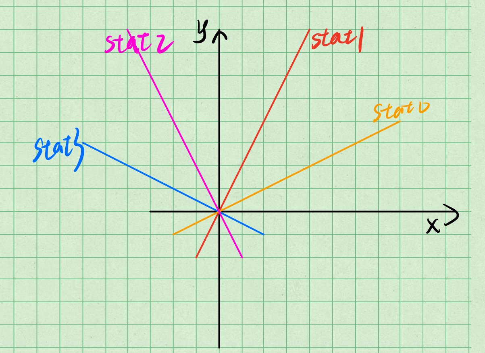

# CG_hw3_pre

## 博客整理：绘制直线的光栅化算法

> 博客：[绘制直线的光栅化算法](https://zhuanlan.zhihu.com/p/20213658)
>
> [用 C 语言画直线](https://zhuanlan.zhihu.com/p/30553006)：Bresenham 极简实现

文章从浅入深一共介绍了 4 种绘制直线的算法（其实第一种不知道能不能算），下面是在文章的基础上进行补充一点个人理解。

文章假设直线的斜率为 0~1。


### 从这里开始

**在数学的观点来看线段是笔直的，没有宽度的。但是在显示器上由于像素呈现四边形，理论上无法完全模拟线段的本来面目，所以只能用近似的方法来让它“看起来”是一条线段，这就是直线的光栅化。**

斜截式：$y = kx+b$

对于每个 $x$ ，使用斜截式公式求解 $y$

对 $y$ 进行 $round$

缺点：存在乘法

### 数值微分 DDA (Digital Differential Analyzer)算法

依然使用斜截式：$y=kx+b$

**消灭乘法**，$x$ 每前进 1 步，则 $y$ 前进 $k$ 步（解析几何）

对 $y$ 进行 $round$

仍然存在问题：

1. 每次递增 $x$ 的方式显然不适合斜率过大的直线。斜率过大会导致屏幕上显示的点少而且稀疏，甚至并不能在屏幕上显示出人可以辨识出的直线形状。

   比较容易解决的。可以在斜率小于 1 的时候采用递增 $x$ 的方式，在斜率大于 1 的时候采用递增 $y$ 的方式来画直线。

2. 效率仍然比较低

   虽然我们已经把乘法变成了加法，但是这是一个浮点数的加法。虽然现代计算机都有协处理器来计算浮点数，但和整数加法效率想想也知道是没法比的。

### 中点画线算法

一般式：$Ax+By+C=0​$

中点画线算法使用直线的一般式来绘制直线。

一般式将平面上点分成3个部分，将点代入，等于0时点在直线上，大于0时在直线的一侧，小于0在另一侧。

**怎么看一点在一个一般式的上方还是下方(或是在线上)呢？结论是将点坐标代入式中，和0比较。若式子等于0，则点在直线上，若式子大于0则在直线上方，小于0则在直线下方。 这其实是一个很简单的结论，但是问过的人包括一些老师绝大多数都把这点搞错了。**

考虑斜率属于的情况。假设现在我们画完了点，那么下一个点必然画在或者。那么我们不妨画在那个最接近原始直线的点。我们考虑两个点的中点在直线上方还是下方，从而确定应该画哪个点。如果中点在直线上方，那么显然应该画点，反之画点。

伪代码

```text
y = y0
foreach x in (x0,x1):
	draw(x,y)
	if(B*(A*(x+1)+B*(y+0.5)+C) < 0) ++y;//中点与下面的点同侧，所以画上面的点
```

这样的算法效率显然不够好，有乘法，所以考虑使用增量算法。仍然假设斜率为0到1之间，并且我们已经画好了点，将中点代入有

下面考虑:

- 如果下一个点画在了,紧接着考虑的应该是中点，代入直线一般式方程得到
- 如果下一个点画在了考虑的应该是中点，代入直线一般式方程得到

于是我们得到了关于d的递推公式

(B*d<0时)

(B*d>=0时)

这时，我们的中点画线算法至少达到了和DDA算法一样的效率(浮点数加法)。但是这里的A和B都是整数，所以我们考虑把d全部扩大一倍(因为和0比较不影响)，这样，成功避开了浮点数加法。

使用中点画线法模拟生成的直线:


代码:

```cpp
#include <iostream>
#include <cmath>
using namespace std;
bool pic[50][50];
void DrawALine(int x0,int y0,int x1,int y1)
{
	int d = 2*(y0-y1)+(x1-x0);	// = 2A+B
    							// 对于 d，我们只关注其正负，目的是判断中点在线的上方还是下方
	int y = y0;
	for(auto x = x0 ; x <= x1 ; ++ x) {
		pic[y][x] = true;
		if(d < 0) {				// 如果是在下方，那么下一个点应该在(x_i+1,y_i+1)
			d += 2*(y0-y1)+2*(x1-x0);	// 下一个点的下一个中点应该是 d（之前的） + A + B
            							// 我们先递增好 d 用于下一次迭代的判断
			++ y;				
		}
		else d += 2*(y0-y1);	// 如果是在上方，那么下一个点应该在(x_i+1,y_i)
	}
}
void ShowPic()
{
	for(auto i = 49 ; i >= 0 ; -- i) {
		for(auto j:pic[i]) {
			if(j) cout << 'o';
			else cout << 'x';
		}
		cout << endl;
	}
}
int main()
{
	DrawALine(2,2,45,20);
	ShowPic();
	return 0;
}
```


关键在于理解 $A$ 和 $B$ 是什么？实际上 $A$ 和 $B$ 反映了直线上 $x$ 和 $y$ 变化的敏感程度，$x$ 增加 $B$，则 $A(x+B)+By+C=AB$，此时必有 $y$ 减少 $A$ 才能保证一般式值等于 0，即 $A(x+B)+B(y-A)+C=AB-BA=0$。这说明了每当 $x$ 变化 $B$，则 $y$ 变化 $A$。

假设有线上两点 $(x_0, y_0)， (x_1, y_1)$，则有
$$
\frac{x_1-x_0}{y_1-y_0}=-\frac{A}{B}
$$

### Bresenham算法

**Bresenham算法的思想是将像素中心构造成虚拟网格线，按照直线起点到终点的顺序，计算直线与各垂直网格线的交点，然后根据误差项的符号确定该列像素中与此交点最近的像素。**

如图


如DDA算法一样，每次x加1的时候纵方向就加了k，保存一个d值，如果d


0.5，那么就画在下面的点，如果d>0.5就画在上面的点。每次检查d是否在[0,1)范围内，不在需要d减1。算法的伪代码如下


```text
d = 0
y = y0
／／在此根据不同的方程处理好k的值
foreach x in (x0,x1)
    draw(x,y)
    d += k
    if(d>=1) d -= 1;
    if(d > 0.5) ++y;
```

这样算法的效率是浮点数加法，下面改进成整数加法。

- 首先可以将d与0.5比较(浮点数比较)进行优化

**令，这样e的初始值变成-0.5，并且当e>=0.5时将e-=1。这样只需要看e的符号就可以知道画在哪个像素上了。**

- 从上一点继续考虑

**既然我们只用到了e的符号，那么也可以用做到这一点。所以现在e的初始值为，又因为 所以每次加k就是加。如果大于那么就减去。**

让我们用经过优化的Bresenham算法模拟画一条直线


代码:

```cpp
#include <iostream>
#include <cmath>
using namespace std;
bool pic[50][50];
void DrawALine(int x0,int y0,int x1,int y1)
{
	int dx = fabs(x0-x1);
	int dy = fabs(y0-y1);
	int y = y0;
	int e = -dx;
	for(auto x = x0 ; x <= x1 ; ++ x) {
		pic[y][x] = true;
		e += 2*dy;
		if(e > 0) ++y;
		if(e >= dx) e -= 2*dx;
	}
}
void ShowPic()
{
	for(auto i = 49 ; i >= 0 ; -- i) {
		for(auto j:pic[i]) {
			if(j) cout << 'x';
			else cout << 'o';
		}
		cout << endl;
	}
}
int main()
{
	DrawALine(2,2,40,10);
	ShowPic();
	return 0;
}
```

从代码可以看到效率是整数加法的。Bresenham算法总结了DDA算法和中点画线算法的优点，应用更加广泛。

---

感觉中点画线算法和DDA算法基本上是一样的 = =。


## 如何绘制非基本情况的直线

> 上面的文章讲述了绘制直线的几种光栅化算法，在介绍这几种算法之前，我们都假定：
>
> * 直线的斜率为 $0$ ~ $1$，也即 $dx > dy$
>
> * $x_0 < x_1$ 且 $y_0 < y_1$
>
> 我们把符合上述条件的直线称为基本情况的直线，现在我们来探讨如何绘制非基本情况的直线

我们先不讨论与 $x$ 轴或 $y$ 轴平行的线，而是讨论如下三种直线：



* stat0：

  首先 stat0 就是我们所说的基本情况的直线

  1. $x_0<x_1,\ y_0<y_1,\ dx>dy​$：无需处理

  2. $x_0>x_1,\ y_0>y_1,\ dx > dy$：$swap(p_0, p_1)$ to 1.

* stat1:

  3. $x_0<x_1,\ y_0<y_1,\ dx<dy$：$flipXY(p_0) + flipXY(p_1)$ to 1.
  4. $x_0>x_1, \ y_0>y_1,\ dx<dy$：$swap(p_0,p_1)$ to 3.

* stat2:
  5. $x_0>x_1,\ y_0<y_1,\ dx<dy$：$negX(p_0)+negX(p1)$ to 3.
  6. $x_0 <x_1,\ y_0>y_1,\ dx<dy$：$swap(p0, p1)$ to 5.
* stat3:
  7. $x_0>x_1,\ y_0<y_1,\ dx>dy$：$negX(p_0)+negX(p_1)$ to 1.
  8. $x_0<x_1,\ y_0>y_1,\ dx>dy$：$swap(p_0,p_1)$ to 7.

```
bool swapFlag1 = false
bool negFlag = false
bool swapFlag2 = false
bool flipFlag = false

if p0.x < p1.x and p0.y > p1.y
	swap(p0, p1)

if p0.x > p1.x and p0.y < p1.y
	negX(p0)
	negX(p1)
	
if p0.x > p1.x and p0.y > p1.y
	swap(p0, p1)

if dx < dy
	flipXY(p0)
	flipXY(p1)
	
```

然后我们来讨论与 $x$ 轴平行或 $y$ 轴平行的线。实际上如何绘制这两种直线是显而易见的，对于这种直线，我们根本不需要使用 Bresenham 算法来绘制，因为下一个点是肯定的已知的，而非可能会有两个可能的落点！

```
// 对于 dx 或 dy 等于 0，上面前三个 if 不执行
// 对于 dx 等于 0，第四个 if 会帮助我们将其翻转为与 x 轴平行的情况
// 所以在上面的基础上只需要最后再对 dx 是否等于 0 分别进行处理
// 等于 0 直接往右不断绘制点（当然还要注意是否需要 swap(p0,p1)）
// 不等于 0 即使用 Bresenham 绘制斜线
```

## 使用 Bresenham 算法绘制一个圆

> 文章：[bresenham中点画圆原理介绍](https://wenku.baidu.com/view/7a88ff22ccbff121dd368331.html)
>
> https://blog.csdn.net/MMogega/article/details/53055625


