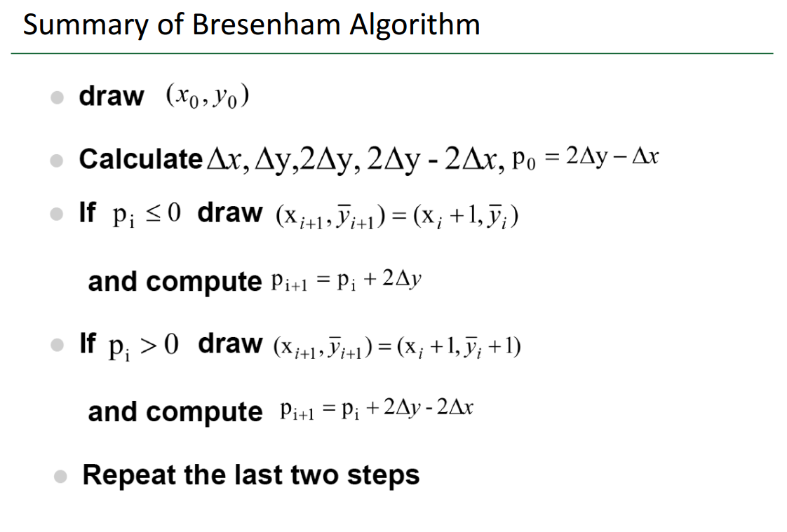

## Homework 3 - Draw line 

`16340237_吴聪_HW3_v0`

[TOC]

### Basic

#### Bresenham 画三角形边框

> 使用 Bresenham 算法（只使用 integer arithmetic）画一个三角形边框：input 为三个 2D 点；ouput 三条直线（要求图元只能用 `GL_POINTS`，不能使用其他，比如 `GL_LINES` 等）

##### 实现思路

规定图元只能使用 `GL_POINTS`，那么要绘制一条直线，我们需要自己求出直线上的所有点，然后和三角形的顶点一起使用 `GL_POINTS` 绘制出来。

* 绘制基本情况的直线
* 绘制任何情况的直线
* 绘制三角形

为了让三角形能够最后在 OpenGL 中渲染出来，我们需要把这些三角形上的所有顶点都转换为 NDC（Normalized Device Coordinate，标准设备坐标）

##### 算法概览

> Bresenham 算法大致如下



代码实现如下：

```c++
std::vector<Point> genLineData(const Point& p0_, const Point& p1_)
{
    // ...

    if (dx != 0) // line that is not parallel to x or y axis: draw basic line
    {
        // Bresenham
        int b_dx = p1.x - p0.x;
        int b_dy = p1.y - p0.y;
        int p = 2 * b_dy - b_dx;

        for (auto x = p0.x, y = p0.y; x <= p1.x; ++x) 
        {
            pvec.push_back(Point(x, y));
            if (p > 0)
            {
                p += (2 * b_dy - 2 * b_dx);
                ++y;
            }
            else
            {
                p += 2 * b_dy;
            }
        }

        // reverse the transformation from basic line to the origin line
        // ...

    }
    // ...
}
```

注意老师课件中给出的算法实际上要求给定的直线是符合基本情况的：

- 直线的斜率为 $0$ ~ $1$，也即 $dx > dy$
- $x_0 < x_1$ 且 $y_0 < y_1$

显然我们不能满足于此，那么如何绘制非基本情况的直线呢？

我们先不讨论与 $x​$ 轴或 $y​$ 轴平行的线，而是讨论如下三种直线（stat1,、stat2 和 stat3）：


对于非基本情况的直线，我们通过先做对称变换预处理，把情况转到基本情况，画完先后再把所有点逆变换回去，下面给出每种情况的预处理过程，其中 $swap(p_0, p_1)$ 表示交换两点，$negX(p_0)$ 表示将 $p_0$ 的 $x$ 取负（反），$flipXY(p_0)$ 表示将 $p_0$ 的 $x,y$ 交换：

* stat0：

  首先 stat0 就是我们所说的基本情况的直线

  1. $x_0<x_1,\ y_0<y_1,\ dx>dy$：无需处理

  2. $x_0>x_1,\ y_0>y_1,\ dx > dy​$：$swap(p_0, p_1)​$ to 1.

* stat1:

  3. $x_0<x_1,\ y_0<y_1,\ dx<dy​$：$flipXY(p_0) + flipXY(p_1)​$ to 1.
  4. $x_0>x_1, \ y_0>y_1,\ dx<dy$：$swap(p_0,p_1)$ to 3.

* stat2:
  5. $x_0>x_1,\ y_0<y_1,\ dx<dy​$：$negX(p_0)+negX(p1)​$ to 3.
  6. $x_0 <x_1,\ y_0>y_1,\ dx<dy$：$swap(p0, p1)$ to 5.

* stat3:
  7. $x_0>x_1,\ y_0<y_1,\ dx>dy$：$negX(p_0)+negX(p_1)$ to 1.
  8. $x_0<x_1,\ y_0>y_1,\ dx>dy$：$swap(p_0,p_1)$ to 7.

代码实现如下：

```c++
bool negFlag = false;
bool flipFlag = false;

int dx = std::abs(p0.x - p1.x);
int dy = std::abs(p0.y - p1.y);

if (p0.x < p1.x && p0.y > p1.y)	// 对于情况 8. 和 6.
{
    swap(p0, p1);				// swap 使其分别转换到情况 7. 和 5.
}

if (p0.x > p1.x && p0.y < p1.y)	// 对于情况 7. 和 5.（包括情况 8. 和 6. 转换而来的）
{
    negX(p0);
    negX(p1);
    negFlag = true;				// negX 使其分别转换到情况 1. 和 3.
}

if (p0.x > p1.x && p0.y > p1.y)	// 对于情况 2. 和 4.
{
    swap(p0, p1);				// swap 使其分别转换到情况 1. 和 3.
}

if (dx < dy)					// 到这里只剩下情况 1. 和 3. 的直线了，对于情况 3.
{
    flipXY(p0);
    flipXY(p1);
    flipFlag = true;			// flipXY 使情况 3. 转换到情况 1.
}
// 所有情况都转换到了基本情况 1.
```

然后我们来讨论与 $x$ 轴平行或 $y$ 轴平行的线。实际上如何绘制这两种直线是显而易见的，对于这种直线，我们根本不需要使用 Bresenham 算法（非要用也没问题）来绘制，因为下一个点是肯定的已知的，而非可能会有两个可能的落点！

```c++
// 对于 dx 或 dy 等于 0，上面前三个 if 不执行
// 对于 dx 等于 0，第四个 if 会帮助我们将其翻转为与 x 轴平行的情况
// 所以在上面的基础上只需要最后再对 dx 是否等于 0 分别进行处理
// 等于 0 直接往右不断绘制点（当然还要注意是否需要 swap(p0,p1)）
// 不等于 0 即使用 Bresenham 绘制斜线
if (dx != 0) 	// line that is not parallel to x or y axis: draw basic situation line
{
    // Bresenham
}
else			// line that is parallel to x or y axis: not necessary use Bresenham! 
{
    // make sure that the p0.x < p1.x
    if (p0.x > p1.x)
    {
        swap(p0, p1);
    }
	
    // draw directly
    for (auto x = p0.x; x <= p1.x; ++x)
    {
        pvec.push_back(Point(x, 0));
    }
}
```

预处理后的逆变换（代码实现）如下：

```c++
// reverse the transformation from basic line to the origin line
if (flipFlag)
{
    std::for_each(pvec.begin(), pvec.end(), flipXY);
    flipFlag = false;
}

if (negFlag)
{
    std::for_each(pvec.begin(), pvec.end(), negX);
}
```

##### 实现效果


#### Bresenham 画圆

> 使用 Bresenham 算法（只使用 integer arithmetic）画一个圆：input 为一个 2D 点（圆心）、一个 integer 半径；output 为一个圆

##### 算法概览

> 参考博客：[【计算机图形学】中点画圆算法和Bresenham画圆算法](https://blog.csdn.net/MMogega/article/details/53055625)

通过这篇博客我也终于明白了老师课上所讲的中点画圆算法和 Bresenham 画圆算法到底有什么区别：Bresenham 画圆算法消除了浮点运算，提高了效率。

>中点画圆法中，计算判别式 d 使用了浮点运算，影响了圆的生成效率。如果能将判别式规约到整数运算，则可以简化计算，提高效率。于是人们针对中点画圆法进行了多种改进，其中一种方式是将 d 的初始值由 1.25 – R 改成 1 – R，考虑到圆的半径 R 总是大于 2，因此这个修改不会影响 d 的初始值的符号，同时可以避免浮点运算。还有一种方法是将 d 的计算放大两倍，同时将初始值改成 3 – 2R，这样避免了浮点运算，乘二运算也可以用移位快速代替，采用 3 – 2R 为初始值的改进算法，又称为 Bresenham 算法

代码实现如下：

```c++
std::vector<Point> genCircleData(const Point& origin, const int R)
{
    std::vector<Point> pvec;

    int x = 0;
    int y = R;
    int d = 3 - 2 * R;

    while (x <= y)
    {
        addCirclePlot(pvec, origin, x, y);
        if (d < 0)
        {
            d += (4 * x + 6);
        }
        else
        {
            d += (4 * (x - y) + 10);
            --y;
        }
        ++x;
    }

    return pvec;
}
```

##### 实现效果


#### 添加 GUI —— 允许调整圆的大小

>添加 GUI 菜单栏，可以选择是三角形边框还是圆，以及能调整的圆的大小（圆心固定即可）

将一个 `radius` 变量与 GUI 关联起来，这通过 `ImGui::SliderInt("radius", &radius, 10, 200);` 来完成，规定 `radius` 的变量可以通过拖动 sliderbar 来改变且范围在 10~200。

##### 实现效果

> 增大 `radius` （从 100 到 200）


> 减小 `raidus`（从 100 到 10）


### Bonus

#### 填充三角形

> 使用三角形光栅转换算法，用和背景不同的颜色，填充你的三角形

##### 算法概览

光栅化一个三角形主要有三种方法：

* Edge-walking
* Edge-equation
* Barycentric-coordinate based

这里使用 Edge-equation 来实现。Edge-equation 算法大致如下：


为了提高效率，我们需要创建三角形对应的 bounding box，这个 bounding box 是一个最小的能够将整个三角形覆盖的矩形区域，代码实现如下：

```c++
struct bBox
{
	int xmin;
	int xmax;
	int ymin;
	int ymax;
};

// since the point's coor are int type, so do not need to ceil
void bound3(const Point& p0, const Point& p1, const Point& p2, bBox& bbox)
{
    bbox.xmin = min3(p0.x, p1.x, p2.x);
    bbox.xmax = max3(p0.x, p1.x, p2.x);
    bbox.ymin = min3(p0.y, p1.y, p2.y);
    bbox.ymax = max3(p0.y, p1.y, p2.y);
}
```

遍历 bounding box 中的每个点，判断其是否在三角形内。判断方法如下：

* 首先对三角形的每条边（比如 $p_0p_1$），我们都确定三角形内侧的一般式符号是什么。

  我们将剩下的点 $p_2$ 代入到直线 $p_0 p_1$ 的一般式中，得到结果 $f_2$，结果 $f2$ 的正负号也即三角形内侧的符号。对三条边，我们就分别得到了三个正负号，这三个正符号将在下一步起作用。

* 对于 bounding box 中的每个点，将点分别代入三角形每条边的一般式中，判断其正负号是否符合三角形内侧的一般式符号（是否同号）：

  比如我们将某点 $p_k$ 代入到直线 $p_0p_1$ 中，如果结果与 $f_2$ 同号，那么我们再将 $p_k$ 代入到 $p_0p_2$ 和 $p_1p_2$ 中去，如果结果都与相应的 $f_1$ 和 $f_0$ 同号，那么就表示 $p_k$ 在三角形内部。

代码实现如下：

```c++
std::vector<int> getABC(const Point& p0, const Point& p1)
{
    // line equation: Ax + By + C = 0
    std::vector<int> ABC(3);

    ABC[0] = p0.y - p1.y;
    ABC[1] = p1.x - p0.x;
    ABC[2] = p0.x * p1.y - p1.x * p0.y;

    return ABC;
}

int checkInsideSymbol(std::vector<int>& ABC, const int x, const int y)
{
    int f = ABC[0] * x + ABC[1] * y + ABC[2];
    return (f > 0) ? 1 : -1;
}

std::vector<Point> edgeEquations(const Point& p0, const Point& p1, const Point& p2)
{
    std::vector<Point> pvec;
    bBox bbox;
    bound3(p0, p1, p2, bbox);

    // get 3 lines params
    std::vector<int> linesABC[3] = {};
    linesABC[0] = getABC(p0, p1);
    linesABC[1] = getABC(p0, p2);
    linesABC[2] = getABC(p1, p2);

    int insideSymbol[3] = {};
    insideSymbol[0] = checkInsideSymbol(linesABC[0], p2.x, p2.y);
    insideSymbol[1] = checkInsideSymbol(linesABC[1], p1.x, p1.y);
    insideSymbol[2] = checkInsideSymbol(linesABC[2], p0.x, p0.y);

    for (int i = bbox.xmin; i <= bbox.xmax; ++i)
    {
        for (int j = bbox.ymin; j <= bbox.ymax; ++j)
        {
            bool inside = true;
            for (int k = 0; k < 3; ++k)
            {
                // check if the points has same symbol
                if (checkInsideSymbol(linesABC[k], i, j) * insideSymbol[k] <= 0)	// if not(points are on the other side or on the line)
                {
                    inside = false;
                    break;
                }
            }
            if (inside)
            {
                pvec.push_back(Point(i, j));
            }

        }
    }

    return pvec;
}
```

##### 实现效果


