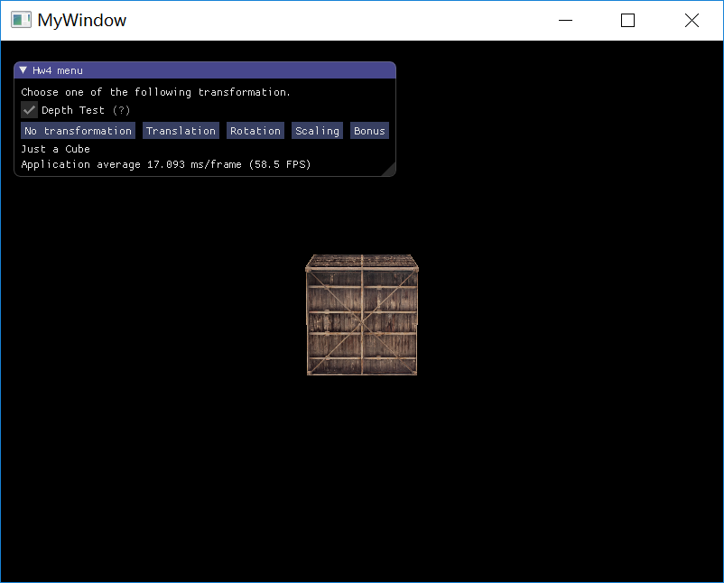
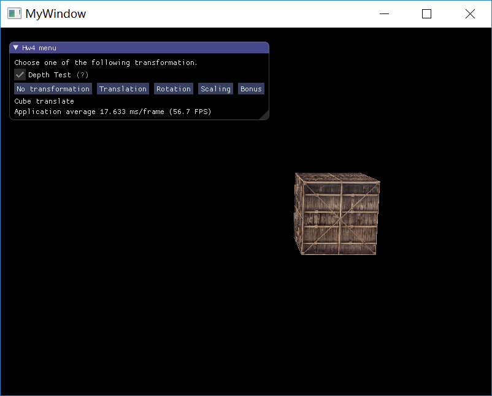
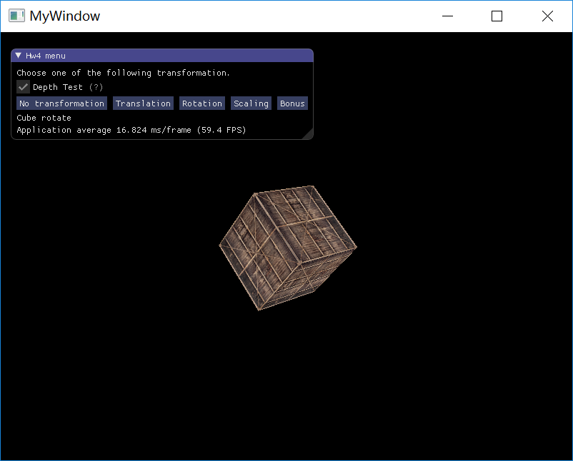
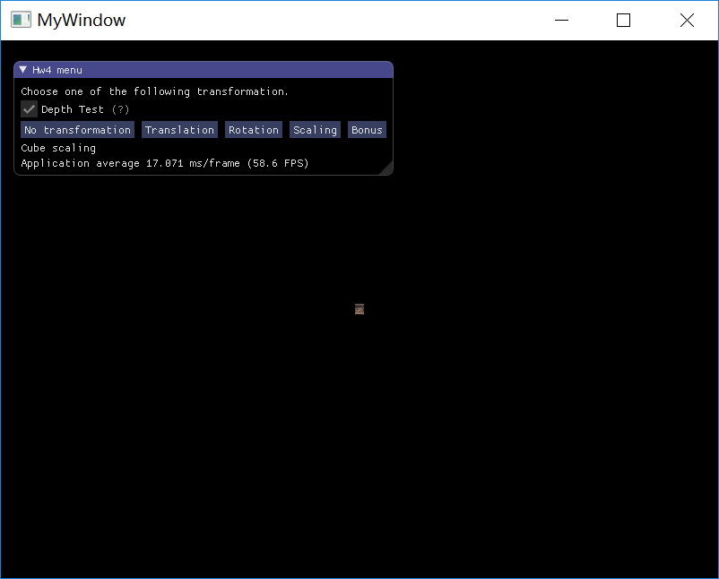
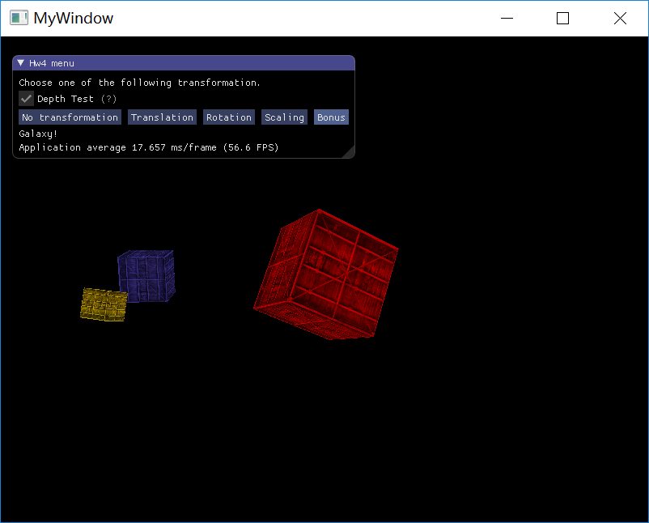

## Homework 4 - Transformation 

`16340237_吴聪_HW4_v0`

[TOC]

### Basic

#### 1. 绘制一个立方体，观察启动和关闭深度测试的区别并分析原因

> 画一个立方体 (Cube)：边长为 4，中心位置为 (0, 0, 0)。分别启动和关闭深度测试 `glEnable(GL_DEPTH_TEST)`、`glDisable(GL_DEPTH_TEST)`，查看区别并分析原因

##### 实现思路

* 设置顶点信息

  要想渲染一个立方体，我们一共需要 36 个顶点（6 个面 x 每个面有 2 个三角形组成 x 每个三角形有 3 个顶点），这 36 个顶点的位置在下面代码块中给出。注意，除了顶点的位置信息以外，我们还设置了一个 `testure coords` ，也即纹理坐标。通过为每个顶点指定纹理坐标，我们能够将纹理映射到立方体的各个面上。添加纹理坐标顶点属性的目的是，使得渲染出的立方体面与面之间是视觉上可分的（当然也可以通过为每个相邻面使用不同的颜色来完成）

  ```c++
  // set up vertex data (and buffer(s)) and configure vertex attributes
  	// ------------------------------------------------------------------
  	GLfloat vertices[] = {
  		// positions          // texture coords
  		-2.0f, -2.0f, -2.0f,  0.0f, 0.0f,
  		 2.0f, -2.0f, -2.0f,  1.0f, 0.0f,
  		 2.0f,  2.0f, -2.0f,  1.0f, 1.0f,
  		 2.0f,  2.0f, -2.0f,  1.0f, 1.0f,
  		-2.0f,  2.0f, -2.0f,  0.0f, 1.0f,
  		-2.0f, -2.0f, -2.0f,  0.0f, 0.0f,
  
  		-2.0f, -2.0f,  2.0f,  0.0f, 0.0f,
  		 2.0f, -2.0f,  2.0f,  1.0f, 0.0f,
  		 2.0f,  2.0f,  2.0f,  1.0f, 1.0f,
  		 2.0f,  2.0f,  2.0f,  1.0f, 1.0f,
  		-2.0f,  2.0f,  2.0f,  0.0f, 1.0f,
  		-2.0f, -2.0f,  2.0f,  0.0f, 0.0f,
  
  		-2.0f,  2.0f,  2.0f,  1.0f, 0.0f,
  		-2.0f,  2.0f, -2.0f,  1.0f, 1.0f,
  		-2.0f, -2.0f, -2.0f,  0.0f, 1.0f,
  		-2.0f, -2.0f, -2.0f,  0.0f, 1.0f,
  		-2.0f, -2.0f,  2.0f,  0.0f, 0.0f,
  		-2.0f,  2.0f,  2.0f,  1.0f, 0.0f,
  
  		 2.0f,  2.0f,  2.0f,  1.0f, 0.0f,
  		 2.0f,  2.0f, -2.0f,  1.0f, 1.0f,
  		 2.0f, -2.0f, -2.0f,  0.0f, 1.0f,
  		 2.0f, -2.0f, -2.0f,  0.0f, 1.0f,
  		 2.0f, -2.0f,  2.0f,  0.0f, 0.0f,
  		 2.0f,  2.0f,  2.0f,  1.0f, 0.0f,
  
  		-2.0f, -2.0f, -2.0f,  0.0f, 1.0f,
  		 2.0f, -2.0f, -2.0f,  1.0f, 1.0f,
  		 2.0f, -2.0f,  2.0f,  1.0f, 0.0f,
  		 2.0f, -2.0f,  2.0f,  1.0f, 0.0f,
  		-2.0f, -2.0f,  2.0f,  0.0f, 0.0f,
  		-2.0f, -2.0f, -2.0f,  0.0f, 1.0f,
  
  		-2.0f,  2.0f, -2.0f,  0.0f, 1.0f,
  		 2.0f,  2.0f, -2.0f,  1.0f, 1.0f,
  		 2.0f,  2.0f,  2.0f,  1.0f, 0.0f,
  		 2.0f,  2.0f,  2.0f,  1.0f, 0.0f,
  		-2.0f,  2.0f,  2.0f,  0.0f, 0.0f,
  		-2.0f,  2.0f, -2.0f,  0.0f, 1.0f
  	};
  ```

* 简单的坐标变换

  如果不进行一些坐标变换，那么直接渲染出现在视口中的将会是填满屏幕的纹理。这是正常的，可以想象一下，我们现在就处于整个立方体的内部的中心，看向立方体的反面（内部的）。而由于我们设置立方体的边长为 4 ，估当这些顶点坐标转换到 NDC 之后，已经超出了我们的视口。

  为了能够看到整个立方体的全貌，我们希望能够让自己（摄像机）的位置后移一段距离，同时再稍微上升一段距离。为了让我们的立方体看起来更自然，我们还会使用透视投影。这通过定义 `view` 以及 `projection` 矩阵并在着色器中对顶点坐标进行变换来完成。

  `view` 以及 `projection` 矩阵的定义如下：

  ```c++
  glm::mat4 model(1.0f);
  		glm::mat4 view(1.0f);
  		view = glm::lookAt(glm::vec3(0.0f, 5.0f, 25.0f),
  			glm::vec3(0.0f, 0.0f, 0.0f),
  			glm::vec3(0.0f, 1.0f, 0.0f));
  		glm::mat4 projection(1.0f);
  		projection = glm::perspective(glm::radians(45.0f), (GLfloat)SCR_WIDTH / SCR_HEIGHT, 0.1f, 100.0f);
  ```

* 设置着色器

  在顶点着色器中，我们传入了顶点位置和顶点纹理坐标，顶点纹理坐标将进一步直接传递到片段着色器中去。此外顶点着色器还传入了 3 个 uniform 的 mat4，分别表示 model，view 和 projection 矩阵，用于和顶点位置相乘来进行坐标变换。

  ```vs
  #version 330 core
  layout (location = 0) in vec3 aPos;
  layout (location = 1) in vec2 aTexCoord;
  
  out vec2 TexCoord;
  
  uniform mat4 model;
  uniform mat4 view;
  uniform mat4 projection;
  
  void main()
  {
  	gl_Position = projection * view * model * vec4(aPos, 1.0);
  	TexCoord = aTexCoord;
  }
  ```

  在片段着色器中，我们接受到来自顶点着色器的顶点纹理坐标。此外片段着色器还传入了两个 unifrom，其中 sampler2D 类型的 ourTexture 主要用于传入纹理，方便片段着色器映射该纹理到立方体上，另外的 vec3 类型的 myColor 主要用于额外再给立方体添加一些颜色，这将在 Bonus 中用到，在 Basic 中设为 `vec3(1.0f, 1.0f, 1.0f)`。

  ```fs
  #version 330 core
  in vec2 TexCoord;
  out vec4 FragColor;
  
  uniform sampler2D ourTexture;
  uniform vec3 myColor;
  
  void main()
  {
      FragColor = texture(ourTexture, TexCoord) * vec4(myColor, 1.0);
  } 
  ```

* 渲染绘制

##### 实验截图

> 勾选或取消勾选来开启或关闭深度测试

* 关闭深度测试 `glDisable(GL_DEPTH_TEST)`

  

* 开启深度测试 `glEnable(GL_DEPTH_TEST)`

  

##### 现象分析

> 参考资料：[坐标系统-更多的3D](<https://learnopengl-cn.github.io/01%20Getting%20started/08%20Coordinate%20Systems/#3d_1>)

在关闭深度测试的情况下，渲染出来的确实有点像是一个立方体，但又有种说不出的奇怪。立方体的某些本应被遮挡住的面被绘制在了这个立方体其他面之上。之所以这样是因为 OpenGL 是一个三角形一个三角形地来绘制你的立方体的，所以即便之前那里有东西它也会覆盖之前的像素。因为这个原因，有些三角形会被绘制在其它三角形上面，虽然它们本不应该是被覆盖的。

OpenGL存储深度信息在一个叫做<font color=green> Z 缓冲</font> (Z-buffer) 的缓冲中，它允许 OpenGL 决定何时覆盖一个像素而何时不覆盖。通过使用 Z 缓冲，我们可以配置 OpenGL 来进行深度测试。

在开启深度测试后，立方体即可正常显示。


#### 2. 平移

> 平移 (Translation)：使画好的 cube 沿着水平或垂直方向来回移动。 

##### 实现思路

`view` 和 `projection` 保持不变，设置 `model` 矩阵来实现水平平移：

```c++
model = glm::translate(model, (GLfloat)sin(glfwGetTime()) * glm::vec3(5.0f, 0.0f, 0.0f));
```

使用 `glm::translate` 函数来设置 `model` 矩阵，使用 `sin` 函数和 `glfwGetTime` 函数来实现在不同时间对立方体位移不同的水平距离，从而实现立方体在水平方向的来回移动（水平方向使用向量为 `glm::vec3(5.0f, 0.0f, 0.0f)`，垂直方向可使用向量为 `glm::vec3(0.0f, 5.0f, 0.0f)`）

##### 实验截图




#### 3. 旋转

> 旋转 (Rotation)：使画好的 cube 沿着 XoZ 平面的 x=z 轴持续旋转。 

##### 实现思路

`view` 和 `projection` 保持不变，设置 `model` 矩阵来实现立方体持续旋转：

```c++
model = glm::rotate(model, (GLfloat)glfwGetTime() * glm::radians(50.0f), glm::vec3(1.0f, 0.0f, 1.0f));
```

使用 `glm::rotate` 函数来设置 `model` 矩阵。要求立方体沿着 XoZ 平面的 x=z 轴持续旋转，故将旋转轴设置为 `glm::vec3(1.0f, 0.0f, 1.0f)`；由于要实现持续的旋转，故需要使用 `glfwGetTime` 函数乘以一个角度 `glm::radians(50.0f)` 来实现不同时间下，不同大小的旋转角度。与 `glfwGetTime` 相乘的角度实际上反映了旋转的快慢。

##### 实验截图




#### 4. 放缩

> 放缩 (Scaling)：使画好的 cube 持续放大缩小。 

##### 实现思路

`view` 和 `projection` 保持不变，设置 `model` 矩阵来实现立方体持续缩放：

```c++
model = glm::scale(model, (GLfloat)sin(glfwGetTime()) * glm::vec3(2.0f));
```

使用 `glm::scale` 函数来设置 `model` 矩阵。由于要实现持续的放大缩小，故我们需要使用 `sin` 函数和 `glfwGetTime` 函数来实现不同时间下，不同程度的缩放。与 `sin(glfwGetTime())` 相乘的 `glm::vec3(2.0f)` 实际上反映了缩放的程度，缩放的放最大能放大到原来的两倍

##### 实验截图

* 缩小：



* 放大：


#### 5. 在 GUI 里添加菜单栏，可以选择各种变换

##### 实现思路

设置一个 `draw_what` 的枚举变量以及多个 `ImGUI::Button`，点击相应的 `Button` 即改变该枚举变量的值。

在渲染时，将该枚举变量传入 `switch` 来选择切换不同的绘制/渲染内容。

##### 实验截图

详见 `doc/demo.gif`


#### 6. 结合 Shader 谈谈对渲染管线的理解

渲染管线，Graphics Pipeline，大多译为管线，实际上指的是一堆原始图形数据途经一个输送管道，期间经过各种变化处理最终出现在屏幕的过程。

在 OpenGL 中，任何事物都在 3D 空间中，而屏幕和窗口却是 2D 像素数组，这导致 OpenGL 的大部分工作都是关于把 3D 坐标转变为适应你屏幕的 2D 像素。3D 坐标转为 2D 坐标的处理过程是由 OpenGL 的<font color=green>图形渲染管线</font>管理的。图形渲染管线可以被划分为两个主要部分：第一部分把你的 3D 坐标转换为 2D 坐标，第二部分是把 2D 坐标转变为实际的有颜色的像素。

图形渲染管线接受一组 3D 坐标，然后把它们转变为你屏幕上的有色 2D 像素输出。图形渲染管线可以被划分为几个阶段，每个阶段将会把前一个阶段的输出作为输入。所有这些阶段都是高度专门化的（它们都有一个特定的函数），并且很容易并行执行。正是由于它们具有并行执行的特性，当今大多数显卡都有成千上万的小处理核心，它们在 GPU 上为每一个（渲染管线）阶段运行各自的小程序，从而在图形渲染管线中快速处理你的数据。这些小程序叫做<font color=green>着色器</font> (Shader)。

有些着色器允许开发者自己配置，这就允许我们用自己写的着色器来替换默认的。这样我们就可以更细致地控制图形渲染管线中的特定部分了，而且因为它们运行在 GPU 上，所以它们可以给我们节约宝贵的 CPU 时间。


图形渲染管线的第一个部分是<font color=green>顶点着色器</font> (Vertex Shader)，它把一个单独的顶点作为输入。顶点着色器主要的目的是把 3D 坐标转为另一种 3D 坐标（也即标准化设备坐标（NDC）），同时顶点着色器允许我们对顶点属性进行一些基本处理。

<font color=green>图元装配</font> (Primitive Assembly) 阶段将顶点着色器输出的所有顶点作为输入，并所有的点装配成指定图元的形状。

图元装配阶段的输出会传递给<font color=green>几何着色器</font> (Geometry Shader)。几何着色器把图元形式的一系列顶点的集合作为输入，它可以通过产生新顶点构造出新的（或是其它的）图元来生成其他形状。

几何着色器的输出会被传入<font color=green>光栅化阶段</font> (Rasterization Stage)，这里它会把图元映射为最终屏幕上相应的像素，生成供片段着色器 (Fragment Shader) 使用的片段 (Fragment)。在片段着色器运行之前会执行裁切 (Clipping)。裁切会丢弃超出你的视图以外的所有像素，用来提升执行效率。

<font color=green>片段着色器</font>的主要目的是计算一个像素的最终颜色，这也是所有 OpenGL 高级效果产生的地方。通常，片段着色器包含 3D 场景的数据（比如光照、阴影、光的颜色等等），这些数据可以被用来计算最终像素的颜色。

在所有对应颜色值确定以后，最终的对象将会被传到最后一个阶段，我们叫做 <font color=green>Alpha 测试</font>和<font color=green>混合</font> (Blending)阶段。这个阶段检测片段的对应的深度（和模板 (Stencil)）值，用它们来判断这个像素是其它物体的前面还是后面，决定是否应该丢弃。这个阶段也会检查 <font color=green>alpha</font> 值（alpha 值定义了一个物体的透明度）并对物体进行混合 (Blend)。所以，即使在片段着色器中计算出来了一个像素输出的颜色，在渲染多个三角形的时候最后的像素颜色也可能完全不同。

可以看到，图形渲染管线非常复杂，它包含很多可配置的部分。然而，对于大多数场合，我们只需要配置顶点和片段着色器就行了。几何着色器是可选的，通常使用它默认的着色器就行了。

### Bonus

#### 地球绕太阳转，月球绕地球转

##### 实现思路

* 使用立方体来替代模拟星球的球体

* 中心最大的红色的立方体是太阳，太阳本身自转

  ```c++
  			// Draw Sun
  			// Sun self rotate
  			model = glm::rotate(model, (GLfloat)glfwGetTime() * glm::radians(-30.0f), glm::vec3(-1.0f, 1.0f, -1.0f));
  ```

  直接使用 `glm::rotate` 来实现自转

* 中等大小的蓝色立方体是地球，地球本身自转，绕太阳旋转

  ```c++
  			// Draw Earth
  			model = glm::mat4(1.0f);
  			// 4. Then totate, it will rotate around (0.0f, 0.0f, 0.0f)
  			model = glm::rotate(model, (GLfloat)glfwGetTime() * glm::radians(50.0f), glm::vec3(0.0f, 1.0f, 0.0f));
  			// 3. Translate 
  			model = glm::translate(model, glm::vec3(8.0f, 0.0f, 0.0f));
  			// 2. Earth self rotate
  			model = glm::rotate(model, (GLfloat)glfwGetTime() * glm::radians(60.0f), glm::vec3(0.0f, 1.0f, 0.0f));
  			// 1. Scale the box to earth
  			model = glm::scale(model, glm::vec3(0.5f));
  ```

  * 首先 `glm::scale(model, glm::vec3(0.5f))` 将初始立方体大小缩小到原来的 0.5 倍
  * 然后 `glm::rotate` 使地球自转（绕中心位置 `0,0,0` 旋转，由于没有位移，故表现为自转）
  * 然后先将地球进行位移，位移至 `glm::vec3(8.0f, 0.0f, 0.0f)` 位置
  * 最后再 `glm::rotate` 来实现地球绕太阳旋转（绕中心位置 `(0,0,0)` 旋转，由于进行了位移，故表现为公转），注意旋转轴的设置（`glm::vec3(0.0f, 1.0f, 0.0f)`）需要和先前的位移向量（`glm::vec3(8.0f, 0.0f, 0.0f)`）正交

* 最小的黄色立方体是月亮，月亮本身自转，绕地球旋转

  ```c++
  			// Draw Moon
  			model = glm::mat4(1.0f);
  			// 5. This two transformation is from Earth 3. & 4.
  			// now the moon will rotate around the Earth's pos
  			model = glm::rotate(model, (GLfloat)glfwGetTime() * glm::radians(50.0f), glm::vec3(0.0f, 1.0f, 0.0f));
  			model = glm::translate(model, glm::vec3(8.0f, 0.0f, 0.0f));
  			// 4. Then totate, it will rotate around (0.0f, 0.0f, 0.0f)
  			model = glm::rotate(model, (GLfloat)glfwGetTime() * glm::radians(150.0f), glm::vec3(1.0f, 1.0f, 0.0f));
  			// 3. Translate
  			model = glm::translate(model, glm::vec3(0.0f, 0.0f, 3.0f));
  			// 2. Moon self rotate
  			model = glm::rotate(model, (GLfloat)glfwGetTime() * glm::radians(-90.0f), glm::vec3(0.0f, 1.0f, 0.0f));
  			// 1. Scale the box to Moon
  			model = glm::scale(model, glm::vec3(0.3f));
  ```

  - 首先 `glm::scale(model, glm::vec3(0.3f))` 将初始立方体大小缩小到原来的 0.3 倍
  - 然后 `glm::rotate` 使月球自转（绕中心位置 `0,0,0` 旋转，由于没有位移，故表现为自转）
  - 然后先将月球进行位移，位移至 `glm::vec3(0.0f, 0.0f, 3.0f)` 位置
  - 然后再 `glm::rotate` 来实现月球绕太阳旋转（绕中心位置 `(0,0,0)` 旋转，由于进行了位移，故表现为公转），注意旋转轴的设置（`glm::vec3(1.0f, 1.0f, 0.0f)`）需要和先前的位移向量（`glm::vec3(0.0f, 0.0f, 3.0f)`）正交
  - 然后将已经绕太阳旋转的月球进行和地球一样的位移与旋转，从而使其绕地球旋转

##### 实验截图

