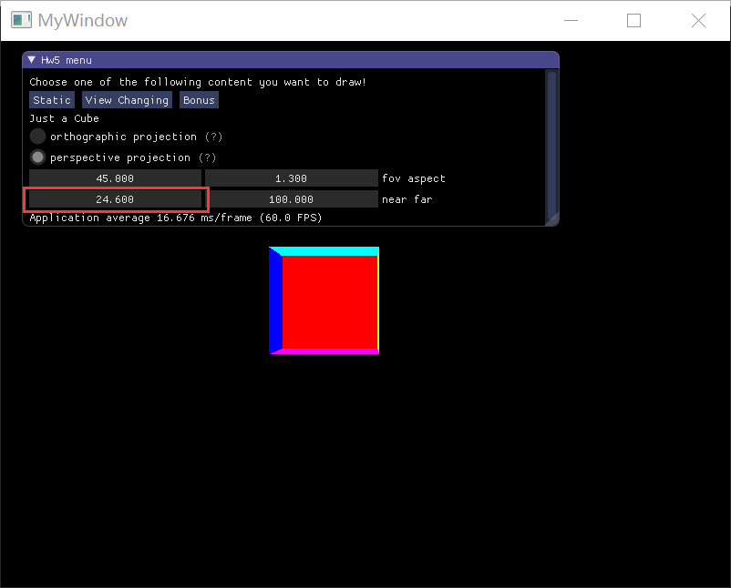

## Homework 5 - Camera 

`16340237_吴聪_HW5_v0`

[TOC]

### Basic

#### 1. 投影（Projection）

> 把上次作业绘制的 cube 放置在 (-1.5, 0.5, -1.5) 位置，要求 6 个面颜色不一致 


```c++
model = glm::translate(model, glm::vec3(-1.5f, 0.5f, -1.5f));
view = glm::lookAt(glm::vec3(0.0f, 0.0f, 25.0f),
                   glm::vec3(0.0f, 0.0f, 0.0f),
                   glm::vec3(0.0f, 1.0f, 0.0f));
```

使用 `glm::translate` 将 cube 放置在 (-1.5f, 0.5f, -1.5f)；使用 `glm::view`  将 cube 变换到观察空间

##### 1.1  正交投影

> 实现正交投影，使用多组 (left, right, bottom, top, near, far) 参数，比较结果差异 

使用 `glm::ortho` 设置正交投影矩阵。

对于 `glm::ortho`（要创建一个正交投影矩阵），我们需要提供其 `left`，`right`，`bottom`，`up`，`near` 以及 `far` 参数。

```c++
float ortho[4] = { -5.5f, 2.5f, -3.0f, 4.0f };
float near_far[2] = { 0.1f, 100.0f };
```

使用以上变量的值设置正交投影矩阵

```c++
projection = glm::ortho(ortho[0], ortho[1], ortho[2], ortho[3], near_far[0], near_far[1]);
```

此时结果如下：

| left (`ortho[0]`) | right (`ortho[1]`) | bottom (`ortho[2]`) | up (`ortho[3]`) | near (`near_far[0]`) | far (`near_far[1]`) |
| ----------------- | ------------------ | ------------------- | --------------- | -------------------- | ------------------- |
| -5.5f             | 2.5f               | -3.0f               | 4.0f            | 0.1f                 | 100.0f              |


> 在 `view` 矩阵中，将摄像机的位置设置为 (0.0f, 0.0f, 25.0f)，现在修改 `near` 和 `far` 参数，将 `near` 参数设置到 25.0f 左右，观察实验结果

| left (`ortho[0]`) | right (`ortho[1]`) | bottom (`ortho[2]`) | up (`ortho[3]`) | near (`near_far[0]`) | far (`near_far[1]`) |
| ----------------- | ------------------ | ------------------- | --------------- | -------------------- | ------------------- |
| -5.5f             | 2.5f               | -3.0f               | 4.0f            | 0.1f                 | 100.0f              |


发现当 `near` 大于 24.5f 之后视图中的矩形变为红色，红色是 cube 的背面（从当前摄像机的视角），这是因为我们把近平面设置得越过了 cube 的正面（绿色）！

反之如果 `near` 重新设置为 0.1f，将 `far` 参数做设置，使得远平面的设置缩小到甚至越不过 cube 的正面。


视口中看不到任何图形，符合预期。

> 以上我们修改的是近平面和远平面的位置，现在对近平面/远平面的大小进行修改，也即修改 `left`，`right`，`bottom` 以及 `up` 参数，修改如下

| left (`ortho[0]`) | right (`ortho[1]`) | bottom (`ortho[2]`) | up (`ortho[3]`) | near (`near_far[0]`) | far (`near_far[1]`) |
| ----------------- | ------------------ | ------------------- | --------------- | -------------------- | ------------------- |
| -15.5f            | 12.5f              | -13.0f              | 14.0f           | 0.1f                 | 100.0f              |

通过如上设置，近平面/远平面的大小变得更大了，但是物体 cube 本身还是 4x4x4 的大小，那么在视口中渲染出的 cube 会相对先前的 cube 要小一点，如下所示：


##### 1.2 透视投影

>  实现透视投影，使用多组参数 (fov aspect, near, far)，比较结果差异 

使用 `glm::perspective` 设置透视投影矩阵。

对于 `glm::perspective`（要创建一个透视投影矩阵），我们需要提供其 `fov`，`aspect`，`near` 以及 `far` 参数。

```c++
float perspect[2] = { 45.0f, 1.3f };
float near_far[2] = { 0.1f, 100.0f };		// near_far 和正视投影部分为同一变量
```

使用以上变量的值设置透视投影矩阵

```c++
projection = glm::perspective(glm::radians(perspect[0]), perspect[1], near_far[0], near_far[1]);
```

此时结果如下：

| fov (`perspect[0]`) | aspect (`perspect[1]`) | near (`near_far[0]`) | far (`near_far[1]`) |
| ------------------- | ---------------------- | -------------------- | ------------------- |
| 45.0f               | 1.3f                   | 0.1f                 | 100.0f              |


首先容易发现的是，在 `model` 以及 `view` 矩阵相同的情况下，使用透视投影输出的 cube 比使用正交投影输出的 cube 略有不同。

实际上，对于正交投影而言，其最终渲染出的 cube 的视觉上的大小只取决于 cube 在正交投影平截头体中的比例大小，所以在我们调整 `left`，`right`，`bottom` 和 `up` 时，视觉输出上的 cube 的大小会改变，而如果我们通过设置 `view` 把摄像机拉远离物体，在正交投影中，cube 视觉上的大小并不会改变。

而在透视投影中，较远处的物体会显得小一点，所以设置 view 把摄像机拉远离物体，在透视投影中，cube 视觉上的大小会变小。

这一点将在 View Changing 中有更加明显的感受！

> 在 `view` 矩阵中，将摄像机的位置设置为 (0.0f, 0.0f, 25.0f)，现在修改 `near` 和 `far` 参数，将 `near` 参数设置到 25.0f 左右，观察实验结果

| fov (`perspect[0]`) | aspect (`perspect[1]`) | near (`near_far[0]`) | far (`near_far[1]`) |
| ------------------- | ---------------------- | -------------------- | ------------------- |
| 45.0f               | 1.3f                   | 0.1f                 | 100.0f              |



和在正交投影中  `near` 大于 24.5f 之后视图中的矩形变为红色不同，此时我们不仅看到了红色（cube 的背面），由于远处的物体在透视的效果下回显得小一点，所以 cube 的背面（红色） 要比 cube 的正面（绿色）要小，从而我们还能看到 cube 的 4 个侧面，其颜色各不相同！

反之如果 `near` 保持为 24.6f，将 `far` 参数做设置，使得远平面的设置缩小到越不过 cube 的背面，但是越过了 cube 的正面，也即将远平面设置在 cube 的中间位置


视口中看不到 cube 的背面（红色），但看得到四个侧面，符合预期。

> 以上我们修改的是近平面和远平面的位置，现在对 `fov` (视场) 和 `aspect`（宽高比）进行修改，我们先对 `fov` 进行修改

| fov (`perspect[0]`) | aspect (`perspect[1]`) | near (`near_far[0]`) | far (`near_far[1]`) |
| ------------------- | ---------------------- | -------------------- | ------------------- |
| 15.0f               | 1.3f                   | 0.1f                 | 100.0f              |


`fov` 定义了我们可以看到场景中多大的范围。当视野变小时，场景投影出来的空间就会减小，产生放大 (Zoom In) 了的感觉，如上所示。

重置 `fov` 为 45.0f，将 `aspect` 设置为 3.0f

| fov (`perspect[0]`) | aspect (`perspect[1]`) | near (`near_far[0]`) | far (`near_far[1]`) |
| ------------------- | ---------------------- | -------------------- | ------------------- |
| 45.0f               | 3.0f                   | 0.1f                 | 100.0f              |


通过将（近平面/远平面的）宽高比增大，原 cube 其宽度在平面中的比例减小，故在视口中的渲染结果看起来宽度变小了。

#### 2. 视角变换（View Changing）

> 把 cube 放置在 (0, 0, 0) 处，做透视投影，使摄像机围绕 cube 旋转，并且时刻看着 cube 中心 

由于 cube 放置在 (0, 0, 0) 处（也即不需要做任何变换），将 `model` 初始化为单位矩阵即可。

```c++
glm::mat4 model(1.0f);
```
摄像机围绕 cube 旋转，并时刻看着 cube 中心，这也即摄像机的位置时刻发生变化，故使用 `glfwGetTime` 来做到时刻修改摄像机的位置，利用三角学的知识，很容易求得摄像机在 x-z 平面上绕 y 轴旋转时的摄像机位置如下：

```c++
		float radius = 25.0f;
		float camX = sin(glfwGetTime()) * radius;
		float camZ = cos(glfwGetTime()) * radius;
```

使用 `glm::lookAt` 设置 `view` 矩阵，其中第二个参数设置为 `glm::vec3(0.0f, 0.0f, 0.0f)` 意味着摄像机时刻看着 cube 中心。

```c++
view = glm::lookAt(glm::vec3(camX, 0.0f, camZ),
				glm::vec3(0.0f, 0.0f, 0.0f),
				glm::vec3(0.0f, 1.0f, 0.0f));
```


#### 3. 为什么在 OpenGL 中将 Model matrix 和 View matrix 合二为一设为 ModelView matrix

>在现实生活中，我们一般将摄像机摆放的空间 View matrix 和被拍摄的物体摆设的空间 Model matrix 分开，但是在 OpenGL 中却将两个合二为一设为 ModelView matrix，通过上面的作业启发，你认为是为什么呢？在报告中写入。（Hints：你可能有不止一个摄像机） 

按照提示，这样做的原因似乎和多个摄像机的情况有关，但其实我又很困惑，因为我觉得在多个摄像机的情况下把 model matrix 和 view matrix 结合起来好像其实也没什么。

摘自 StackExchange 中的回答：

> The reason that the term "modelview matrix" is so prevalent is because of classical graphics pipeline theory and OpenGL, where it was considered standard practice to combine the model-to-world and world-to-view transformations. This was done because there was a very common reason to have geometry in view space: *it simplified the computation of lighting effects*.

旧版本的 OpenGL （固定管线）强制你使用 ModelView 和 Projection 矩阵，而现在可编程管线允许我们将 ModelView 矩阵分开。实际上，个人觉得，ModelView 的唯一好处实际上就是简化了计算。

### Bonus

#### 1. 实现一个 FPS 摄像机

> 实现一个 camera 类，当键盘输入 w, a, s, d ，能够前后左右移动；当移动鼠标，能够视角移动 ("look around")，即类似 FPS (First Person Shooting) 的游戏场景 

在[摄像机 - LearnOpenGL](<https://learnopengl-cn.github.io/01%20Getting%20started/09%20Camera/>)一文中基本对如何实现这样一个 FPS 摄像机类给予了详细的介绍和解释。最终我的实现也是和原文类似：

* 实现了前后左右（w,a,s,d）移动

* 实现了移动鼠标的视角移动，

* 实现了摄像机始终呆在 x-z 平面上，而不能随意飞行：

  在[摄像机 - LearnOpenGL](<https://learnopengl-cn.github.io/01%20Getting%20started/09%20Camera/>)中，作者通过直接将 `Position.y` 设置为 0（每次键盘输入后强制将 y 值置为 0 使摄像机始终处于 x-z 平面），但是这样的方法显然是有问题的：**如果将视角移高 (`pitch=80°`)，然后再向前移动，此时移动速度明显比平视角（`pitch=0°`）要慢得多。**

  ```c++
  void ProcessKeyboard(Camera_Movement direction, float deltaTime)
  {
      float velocity = MovementSpeed * deltaTime;
      if (direction == FORWARD)
          Position += Front * velocity;
      if (direction == BACKWARD)
          Position -= Front * velocity;
      if (direction == LEFT)
          Position -= Right * velocity;
      if (direction == RIGHT)
          Position += Right * velocity;
      // make sure the user stays at the ground level
      Position.y = 0.0f; // <-- this one-liner keeps the user at the ground level (xz plane)
  }
  ```

  在这里我做了修改：先将摄像机的朝向 `Front` 投影到 x-z 平面再对其进行标准化，得到 `front`，使用 `front` 进行移动。

  ```c++
  void ProcessKeyboard(Camera_Movement direction, float deltaTime)
  {
  
    float velocity = MovementSpeed * deltaTime;
    glm::vec3 front = glm::normalize(glm::vec3(Front.x, 0, Front.z));
    if (direction == FORWARD)
      Position += front * velocity;
    if (direction == BACKWARD)
      Position -= front * velocity;
    if (direction == LEFT)
      Position -= Right * velocity;
    if (direction == RIGHT)
      Position += Right * velocity;
  }
  ```

**实验效果**

> 见 `doc/demo.gif`

### 参考

* [Why do we refer to a “model view” matrix and not a “viewprojection” matrix?](https://gamedev.stackexchange.com/questions/95830/why-do-we-refer-to-a-model-view-matrix-and-not-a-viewprojection-matrix)

* [摄像机 - LearnOpenGL](<https://learnopengl-cn.github.io/01%20Getting%20started/09%20Camera/>)