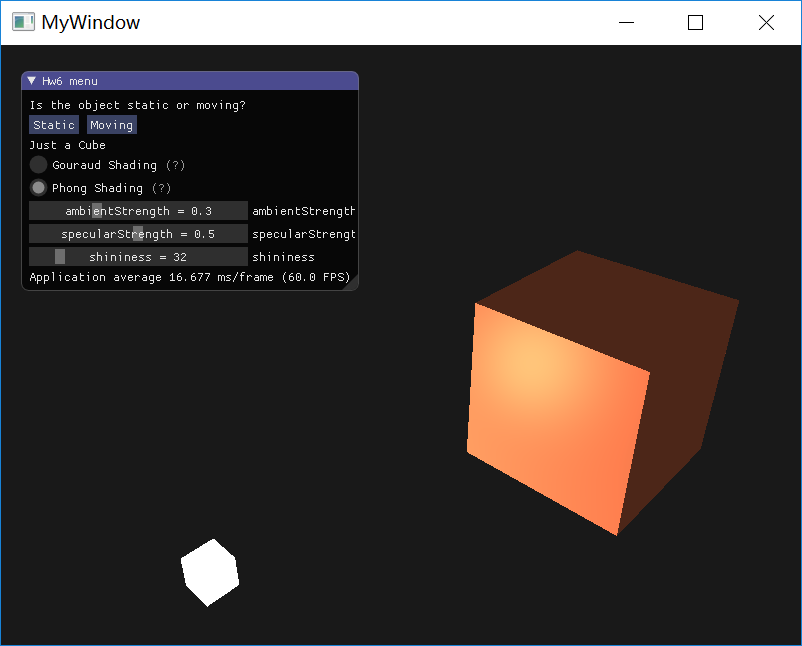
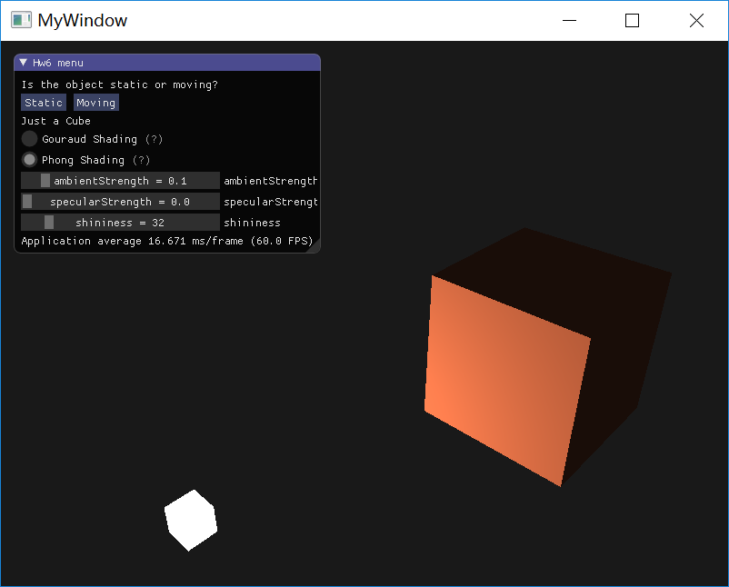

## Homework 6 - Lights and Shading 

`16340237_吴聪_HW6_v0`

[TOC]

### Basic

#### 实现 Phong 光照模型

> * 场景中绘制一个 cube
> * 自己写 shader 实现两种 shading：Phong Shading 和 Gouraud Shading。并解释两种 shading 的实现原理
> * 合理设置视点、光照位置、光照颜色等参数，使光照效果明显显示 

##### 绘制 cube

cube 的绘制和以前的作业基本一样。不过为了实现 Phong 光照模型中的漫反射分量（diffuse），我们简单地对每个顶点都引入其对应的法向量作为顶点数据传入，更新后的顶点数据数组可以在[这里](https://learnopengl.com/code_viewer.php?code=lighting/basic_lighting_vertex_data)找到。

```c++
float vertices[] = {
    -0.5f, -0.5f, -0.5f,  0.0f,  0.0f, -1.0f,
     0.5f, -0.5f, -0.5f,  0.0f,  0.0f, -1.0f, 
     0.5f,  0.5f, -0.5f,  0.0f,  0.0f, -1.0f, 
     0.5f,  0.5f, -0.5f,  0.0f,  0.0f, -1.0f, 
    -0.5f,  0.5f, -0.5f,  0.0f,  0.0f, -1.0f, 
    -0.5f, -0.5f, -0.5f,  0.0f,  0.0f, -1.0f, 
  
		...,
  
    -0.5f,  0.5f, -0.5f,  0.0f,  1.0f,  0.0f,
     0.5f,  0.5f, -0.5f,  0.0f,  1.0f,  0.0f,
     0.5f,  0.5f,  0.5f,  0.0f,  1.0f,  0.0f,
     0.5f,  0.5f,  0.5f,  0.0f,  1.0f,  0.0f,
    -0.5f,  0.5f,  0.5f,  0.0f,  1.0f,  0.0f,
    -0.5f,  0.5f, -0.5f,  0.0f,  1.0f,  0.0f
};
```

相应地，我们需要在顶点属性配置部分做一些修改：

```c++
// position attribute
	glVertexAttribPointer(0, 3, GL_FLOAT, GL_FALSE, 6 * sizeof(float), (void*)0);
	glEnableVertexAttribArray(0);
	// normal attribute
	glVertexAttribPointer(1, 3, GL_FLOAT, GL_FALSE, 6 * sizeof(float), (void*)(3 * sizeof(float)));
	glEnableVertexAttribArray(1);
```

#####Phong Shading & Gouraud Shading 

我们需要实现 3 个不同的着色器，分别是灯（光源）着色器，Phong 着色器和 Gouraud 着色器。

```c++
	Shader phongShader("./shaders/2.1.basic_lighting.vs", "./shaders/2.1.basic_lighting.fs");
	Shader gouraudShader("./shaders/2.2.basic_lighting.vs", "./shaders/2.2.basic_lighting.fs");
	Shader lampShader("./shaders/2.1.lamp.vs", "./shaders/2.1.lamp.fs");
	Shader lightingShader = phongShader;
```

`lightingShader` 是我们在绘制时真正使用的光照着色器，初始化为 `phongShader`，在进行渲染时可以通过 GUI 修改它的值，使其在 `phongShader` 和 `gouraudShader` 之间切换。

* Phong Shading 实现

  **在 Phong Shading 中，光照的计算在片段着色器中完成。**

  * 顶点着色器

    由于我是在**观察坐标**下进行光照的计算，所以需要在顶点着色器中先将片段的位置，法向量以及灯位置都**转换到观察空间**中去，然后传入片段着色器。

  ```c++
  #version 330 core
  layout (location = 0) in vec3 aPos;
  layout (location = 1) in vec3 aNormal;
  
  out vec3 FragPos;
  out vec3 Normal;
  out vec3 LightPos;
  
  uniform vec3 lightPos; // we now define the uniform in the vertex shader and pass the 'view space' lightpos to the fragment shader. lightPos is currently in world space.
  
  uniform mat4 model;
  uniform mat4 view;
  uniform mat4 projection;
  
  void main()
  {
      gl_Position = projection * view * model * vec4(aPos, 1.0);
      FragPos = vec3(view * model * vec4(aPos, 1.0));
      Normal = mat3(transpose(inverse(view * model))) * aNormal;
      LightPos = vec3(view * vec4(lightPos, 1.0)); // Transform world-space light position to view-space light position
  }
  ```

  * 片段着色器

    得到从顶点着色器传入的观察空间下的 `FragPos`，`Normal` 和 `LightPos`，使用这三个分量计算环境光（ambient），漫反射（diffuse）和镜面反射（specular），将这三个光分量结合与物体本身颜色相乘实现最终的光照效果

  ```c++
  #version 330 core
  out vec4 FragColor;
  
  in vec3 FragPos;
  in vec3 Normal;
  in vec3 LightPos;   // extra in variable, since we need the light position in view space we calculate this in the vertex shader
  
  uniform vec3 lightColor;
  uniform vec3 objectColor;
  
  uniform float ambientStrength;
  uniform float specularStrength;	// this is set higher to better show the effect of Gouraud shading 
  uniform int shininess;
  
  void main()
  {
      // ambient
      vec3 ambient = ambientStrength * lightColor;    
      
       // diffuse 
      vec3 norm = normalize(Normal);
      vec3 lightDir = normalize(LightPos - FragPos);
      float diff = max(dot(norm, lightDir), 0.0);
      vec3 diffuse = diff * lightColor;
      
      // specular
      vec3 viewDir = normalize(-FragPos); // the viewer is always at (0,0,0) in view-space, so viewDir is (0,0,0) - Position => -Position
      vec3 reflectDir = reflect(-lightDir, norm);  
      float spec = pow(max(dot(viewDir, reflectDir), 0.0), shininess);
      vec3 specular = specularStrength * spec * lightColor; 
      
      vec3 result = (ambient + diffuse + specular) * objectColor;
      FragColor = vec4(result, 1.0);
  }
  ```

* Gouraud Shading 实现

   **在 Gouraud Shading 中，光照的计算在顶点着色器中完成。**

  * 顶点着色器

    和 Phong Shading 一样，我们同样需要先得到**观察空间**下的片段位置 `Position`，法向量 `Normal` 和 `LightPosition`。但和 Phong Shading 不一样的是，我们在顶点着色器中就进行光照的计算：环境光（ambient），漫反射（diffuse）和镜面反射（specular），然后将这三个分量结合传入到 Gouraud Shading。

  ```c++
  #version 330 core
  layout (location = 0) in vec3 aPos;
  layout (location = 1) in vec3 aNormal;
  
  out vec3 LightingColor; // resulting color from lighting calculations
  
  uniform vec3 lightPos;
  uniform vec3 lightColor;
  
  uniform mat4 model;
  uniform mat4 view;
  uniform mat4 projection;
  
  uniform float ambientStrength;
  uniform float specularStrength;	// this is set higher to better show the effect of Gouraud shading 
  uniform int shininess;
  
  void main()
  {
      gl_Position = projection * view * model * vec4(aPos, 1.0);
      
      // gouraud shading
      // ------------------------
      vec3 Position = vec3(view * model * vec4(aPos, 1.0));
      vec3 Normal = mat3(transpose(inverse(view * model))) * aNormal;
  	  vec3 LightPosition = vec3(view * vec4(lightPos, 1.0));
      
      // ambient
      vec3 ambient = ambientStrength * lightColor;
    	
      // diffuse 
      vec3 norm = normalize(Normal);
      vec3 lightDir = normalize(LightPosition - Position);
      float diff = max(dot(norm, lightDir), 0.0);
      vec3 diffuse = diff * lightColor;
      
      // specular
      vec3 viewDir = normalize(-Position);
      vec3 reflectDir = reflect(-lightDir, norm);  
      float spec = pow(max(dot(viewDir, reflectDir), 0.0), shininess);
      vec3 specular = specularStrength * spec * lightColor;      
  
      LightingColor = ambient + diffuse + specular;
  }
  ```

  * 片段着色器

    在 Gouraud Shading 中，由于光照的计算放到顶点着色器中，所以在片段着色器中我们只需要做很少的工作：将顶点着色器传入的光颜色与物体颜色相乘。

  ```c++
  #version 330 core
  out vec4 FragColor;
  
  in vec3 LightingColor; 
  
  uniform vec3 objectColor;
  
  void main()
  {
     FragColor = vec4(LightingColor * objectColor, 1.0);
  }
  ```

##### 保留摄像机

在本次作业中，我依然**保留了摄像机**以便合理选择视点。为了实现 `IMGUI` 中参数设置和摄像机运动这两者之前切换，我添加的新的键盘输入 `Q` 和 `E`，如下：

```c++
void processInput(GLFWwindow * window)
{
	// ESC
  ...
  
	if (glfwGetKey(window, GLFW_KEY_Q) == GLFW_PRESS)
	{
		// tell GLFW to capture our mouse
		glfwSetInputMode(window, GLFW_CURSOR, GLFW_CURSOR_DISABLED);
		mouseCaptured = true;
	}
	if (glfwGetKey(window, GLFW_KEY_E) == GLFW_PRESS)
	{
		// tell GLFW not to capture our mouse
		glfwSetInputMode(window, GLFW_CURSOR, GLFW_CURSOR_NORMAL);
		mouseCaptured = false;
	}
  // WASD Camera Moving
  ...
	
}
```

按下 `Q` ，GLFW 窗口捕捉鼠标并使鼠标不可见，同时设置 `mouseCaptured` 为 `true`

按下 `W`，GLFW 窗口释放鼠标并使鼠标可见，同时设置 `mouseCaptured` 为 `false`。

`mouseCaptured` 为全局 `bool` 变量，其作为鼠标是否捕捉的标志。在 `mouseCaptured` 为 `false` 时，设置切断摄像机的鼠标输入：

```c++
void mouse_callback(GLFWwindow * window, double xpos, double ypos)
{
  // compute xoffset and yoffset
	...

	if (mouseCaptured)
	{
		camera.ProcessMouseMovement(xoffset, yoffset);
	}

}

void scroll_callback(GLFWwindow * window, double xoffset, double yoffset)
{
	if (mouseCaptured)
	{
		camera.ProcessMouseScroll(yoffset);
	}
}
```

##### 最终效果

**Phong Shading 和 Gouraud Shading 效果对比**

<table>
  <tr>
  	<td><center><span>Gouraud Shading 1</span></center></td>
    <td><center><span>Phong Shading 1</span></center></td>
  </tr>
  <tr>
  	<td><center><span>Gouraud Shading 2</span></center></td>
    <td><center><span>Phong Shading 2</span></center></td>
  </tr>
</table>

通过以上 4 张图片，我们可以发现 Phong Shading 明显要比 Gouraud Shading 更自然更真实一些。

在 Gouraud Shading 中出现了一些比较奇怪的光照效果，比如 `Gouraud Shading 1` 中我们能够比较清楚地看到**一条“亮线”**，`Gouraud Shading 2` 中我们能够比较清楚地看到**一条“暗线”**，实际上这正是插值的结果，一个矩形由两个三角形组成，这里的“亮线”或“暗线”实际上就是两个三角形的 overlap 的那条边！

> 以下内容都在 Phong Shading 下进行

**调整环境光强度（ambientStrength）**

<table>
  <tr>
  	<td><center>ambientStrength = 0.0</center></td>
    <td><center>ambientStrength = 0.3</center></td>
    <td><center>ambientStrength = 1.0</center></td>
  </tr>
</table>

上调环境光强度，最明显地，能看到灯照不到的地方越来越亮

**调整镜面光强度（specularStrength）**

<table>
  <tr>
  	<td><center>specularStrength = 0.0</center></td>
    <td><center>specularStrength = 0.6</center></td>
    <td><center>specularStrength = 1.0</center></td>
  </tr>
</table>

上调镜面光强度，能够发现镜面反射的光强度越来越高，镜面高光越来越明显

**调整反光度（shininess）**

<table>
  <tr>
  	<td><center>shininess = 2</center></td>
    <td><center>shininess = 32</center></td>
    <td><center>shininess = 128</center></td>
  </tr>
</table>

一个物体的反光度越高，反射光的能力越强，散射得越少，高光点就会越小。


### Bonus

#### 光源移动

> 当前光源为静止状态，尝试使光源在场景中来回移动，光照效果实时更改

在渲染循环中使用 `glfwGetTime` 函数和 `sin` 函数结合来设置光源的位置 `lightPos` 即可实现光源的移动，如下 `line 7~9 `。

```c++
			switch (content)
			{
			case draw_what::STATIC:
				ImGui::Text("Just a Cube");
				break;
			case draw_what::MOVING:
				ImGui::Text("Camera rotates around the Cube and looks at the Cube center");
				lightPos.x = 1.0f + sin(glfwGetTime()) * 2.0f;
				lightPos.y = sin(glfwGetTime() / 2.0f) * 1.0f;
				break;
			default:
				break;
			}
```

**实验效果**

> 见 `doc/demo.gif`

### 参考

* [LearnOpenGL CN 光照-颜色]([https://learnopengl-cn.github.io/02%20Lighting/01%20Colors/](https://learnopengl-cn.github.io/02 Lighting/01 Colors/))

* [LearnOpenGL CN 光照-基础光照]([https://learnopengl-cn.github.io/02%20Lighting/02%20Basic%20Lighting/](https://learnopengl-cn.github.io/02 Lighting/02 Basic Lighting/))