# Homework 7 - Shadowing Mapping

`16340237_吴聪_HW7_v0`

[TOC]

## Basic

### 绘制场景中的平面和物体 (用于显示 shadow )

* 给定平面和物体相应的顶点数组

  ```c++
  // 平面顶点数组
  float planeVertices[] = {
    // positions            // normals         // texcoords
    25.0f, -0.5f,  25.0f,  0.0f, 1.0f, 0.0f,  25.0f,  0.0f,
    -25.0f, -0.5f,  25.0f,  0.0f, 1.0f, 0.0f,   0.0f,  0.0f,
    -25.0f, -0.5f, -25.0f,  0.0f, 1.0f, 0.0f,   0.0f, 25.0f,
  
    25.0f, -0.5f,  25.0f,  0.0f, 1.0f, 0.0f,  25.0f,  0.0f,
    -25.0f, -0.5f, -25.0f,  0.0f, 1.0f, 0.0f,   0.0f, 25.0f,
    25.0f, -0.5f, -25.0f,  0.0f, 1.0f, 0.0f,  25.0f, 10.0f
  };
  
  // 物体顶点数组
  float vertices[] = {
  			// back face
  			-1.0f, -1.0f, -1.0f,  0.0f,  0.0f, -1.0f, 0.0f, 0.0f, // bottom-left
  			 1.0f,  1.0f, -1.0f,  0.0f,  0.0f, -1.0f, 1.0f, 1.0f, // top-right
  			 1.0f, -1.0f, -1.0f,  0.0f,  0.0f, -1.0f, 1.0f, 0.0f, // bottom-right         
  			 1.0f,  1.0f, -1.0f,  0.0f,  0.0f, -1.0f, 1.0f, 1.0f, // top-right
  			-1.0f, -1.0f, -1.0f,  0.0f,  0.0f, -1.0f, 0.0f, 0.0f, // bottom-left
  			-1.0f,  1.0f, -1.0f,  0.0f,  0.0f, -1.0f, 0.0f, 1.0f, // top-left
  			// front face
  			-1.0f, -1.0f,  1.0f,  0.0f,  0.0f,  1.0f, 0.0f, 0.0f, // bottom-left
  			 1.0f, -1.0f,  1.0f,  0.0f,  0.0f,  1.0f, 1.0f, 0.0f, // bottom-right
  			 1.0f,  1.0f,  1.0f,  0.0f,  0.0f,  1.0f, 1.0f, 1.0f, // top-right
  			 1.0f,  1.0f,  1.0f,  0.0f,  0.0f,  1.0f, 1.0f, 1.0f, // top-right
  			-1.0f,  1.0f,  1.0f,  0.0f,  0.0f,  1.0f, 0.0f, 1.0f, // top-left
  			-1.0f, -1.0f,  1.0f,  0.0f,  0.0f,  1.0f, 0.0f, 0.0f, // bottom-left
  			// left face
  			-1.0f,  1.0f,  1.0f, -1.0f,  0.0f,  0.0f, 1.0f, 0.0f, // top-right
  			-1.0f,  1.0f, -1.0f, -1.0f,  0.0f,  0.0f, 1.0f, 1.0f, // top-left
  			-1.0f, -1.0f, -1.0f, -1.0f,  0.0f,  0.0f, 0.0f, 1.0f, // bottom-left
  			-1.0f, -1.0f, -1.0f, -1.0f,  0.0f,  0.0f, 0.0f, 1.0f, // bottom-left
  			-1.0f, -1.0f,  1.0f, -1.0f,  0.0f,  0.0f, 0.0f, 0.0f, // bottom-right
  			-1.0f,  1.0f,  1.0f, -1.0f,  0.0f,  0.0f, 1.0f, 0.0f, // top-right
  			// right face
  			 1.0f,  1.0f,  1.0f,  1.0f,  0.0f,  0.0f, 1.0f, 0.0f, // top-left
  			 1.0f, -1.0f, -1.0f,  1.0f,  0.0f,  0.0f, 0.0f, 1.0f, // bottom-right
  			 1.0f,  1.0f, -1.0f,  1.0f,  0.0f,  0.0f, 1.0f, 1.0f, // top-right         
  			 1.0f, -1.0f, -1.0f,  1.0f,  0.0f,  0.0f, 0.0f, 1.0f, // bottom-right
  			 1.0f,  1.0f,  1.0f,  1.0f,  0.0f,  0.0f, 1.0f, 0.0f, // top-left
  			 1.0f, -1.0f,  1.0f,  1.0f,  0.0f,  0.0f, 0.0f, 0.0f, // bottom-left     
  			// bottom face
  			-1.0f, -1.0f, -1.0f,  0.0f, -1.0f,  0.0f, 0.0f, 1.0f, // top-right
  			 1.0f, -1.0f, -1.0f,  0.0f, -1.0f,  0.0f, 1.0f, 1.0f, // top-left
  			 1.0f, -1.0f,  1.0f,  0.0f, -1.0f,  0.0f, 1.0f, 0.0f, // bottom-left
  			 1.0f, -1.0f,  1.0f,  0.0f, -1.0f,  0.0f, 1.0f, 0.0f, // bottom-left
  			-1.0f, -1.0f,  1.0f,  0.0f, -1.0f,  0.0f, 0.0f, 0.0f, // bottom-right
  			-1.0f, -1.0f, -1.0f,  0.0f, -1.0f,  0.0f, 0.0f, 1.0f, // top-right
  			// top face
  			-1.0f,  1.0f, -1.0f,  0.0f,  1.0f,  0.0f, 0.0f, 1.0f, // top-left
  			 1.0f,  1.0f , 1.0f,  0.0f,  1.0f,  0.0f, 1.0f, 0.0f, // bottom-right
  			 1.0f,  1.0f, -1.0f,  0.0f,  1.0f,  0.0f, 1.0f, 1.0f, // top-right     
  			 1.0f,  1.0f,  1.0f,  0.0f,  1.0f,  0.0f, 1.0f, 0.0f, // bottom-right
  			-1.0f,  1.0f, -1.0f,  0.0f,  1.0f,  0.0f, 0.0f, 1.0f, // top-left
  			-1.0f,  1.0f,  1.0f,  0.0f,  1.0f,  0.0f, 0.0f, 0.0f  // bottom-left        
  		};
  ```

* 配置顶点属性指针

  ```c++
  // plane VAO
  	unsigned int planeVBO;
  	glGenVertexArrays(1, &planeVAO);
  	glGenBuffers(1, &planeVBO);
  	glBindVertexArray(planeVAO);
  	glBindBuffer(GL_ARRAY_BUFFER, planeVBO);
  	glBufferData(GL_ARRAY_BUFFER, sizeof(planeVertices), planeVertices, GL_STATIC_DRAW);
  	glEnableVertexAttribArray(0);
  	glVertexAttribPointer(0, 3, GL_FLOAT, GL_FALSE, 8 * sizeof(float), (void*)0);
  	glEnableVertexAttribArray(1);
  	glVertexAttribPointer(1, 3, GL_FLOAT, GL_FALSE, 8 * sizeof(float), (void*)(3 * sizeof(float)));
  	glEnableVertexAttribArray(2);
  	glVertexAttribPointer(2, 2, GL_FLOAT, GL_FALSE, 8 * sizeof(float), (void*)(6 * sizeof(float)));
  	glBindVertexArray(0);
  
  // cube VAO
  glGenVertexArrays(1, &cubeVAO);
  glGenBuffers(1, &cubeVBO);
  // fill buffer
  glBindBuffer(GL_ARRAY_BUFFER, cubeVBO);
  glBufferData(GL_ARRAY_BUFFER, sizeof(vertices), vertices, GL_STATIC_DRAW);
  // link vertex attributes
  glBindVertexArray(cubeVAO);
  glEnableVertexAttribArray(0);
  glVertexAttribPointer(0, 3, GL_FLOAT, GL_FALSE, 8 * sizeof(float), (void*)0);
  glEnableVertexAttribArray(1);
  glVertexAttribPointer(1, 3, GL_FLOAT, GL_FALSE, 8 * sizeof(float), (void*)(3 * sizeof(float)));
  glEnableVertexAttribArray(2);
  glVertexAttribPointer(2, 2, GL_FLOAT, GL_FALSE, 8 * sizeof(float), (void*)(6 * sizeof(float)));
  glBindBuffer(GL_ARRAY_BUFFER, 0);
  glBindVertexArray(0);
  ```

* 摆放场景中的平面和物体（方块），进行绘制

  ```c++
  void renderScene(const Shader &shader)
  {
      // floor
      glm::mat4 model = glm::mat4(1.0f);
      shader.setMat4("model", model);
      glBindVertexArray(planeVAO);
      glDrawArrays(GL_TRIANGLES, 0, 6);
  
      // cubes
      model = glm::mat4(1.0f);
      model = glm::translate(model, glm::vec3(0.0f, 1.5f, 0.0));
      model = glm::scale(model, glm::vec3(0.5f));
      shader.setMat4("model", model);
      renderCube();
      model = glm::mat4(1.0f);
      model = glm::translate(model, glm::vec3(1.0f, 0.0f, -1.0));
      model = glm::scale(model, glm::vec3(0.5f));
      shader.setMat4("model", model);
      renderCube();
      model = glm::mat4(1.0f);
      model = glm::translate(model, glm::vec3(-1.0f, 0.0f, 1.0));
      model = glm::rotate(model, glm::radians(60.0f), glm::normalize(glm::vec3(1.0, 0.0, 1.0)));
      model = glm::scale(model, glm::vec3(0.25));
      shader.setMat4("model", model);
      renderCube();
  }
  ```

  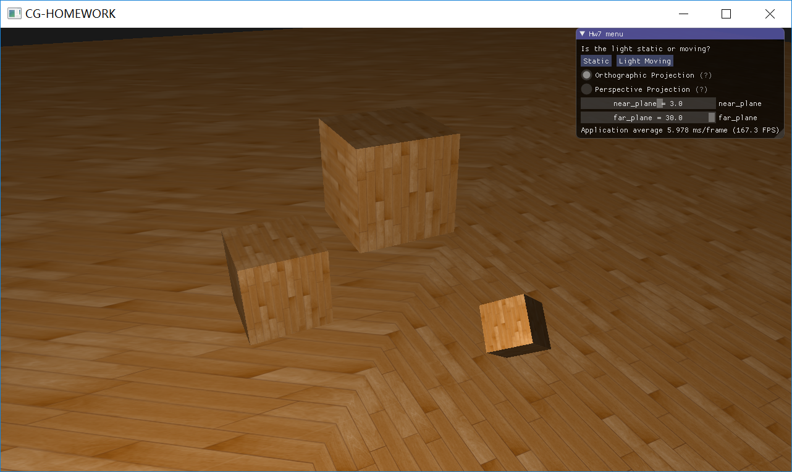

### 实现方向光源的 Shadow Mapping

Shadow Mapping 背后的思路非常简单：我们以光的位置为视角进行渲染，我们能看到的东西都将被点亮，看不见的一定是在阴影之中了。如果我们绘制一条从光源出发的射线，我们希望得到射线第一次击中的那个物体，那么我们可以对射线击中的所有物体的击中点进行比较，除了最近的击中点之外，其他所有击中点都应该被渲染为带阴影的。

这看起来是个不错的解决方案，但是对从光源发出的射线上的成千上万个点进行遍历是个极端消耗性能的举措，实时渲染上基本是不可取的。

但这并不意味着以光的位置为视角进行渲染的思路是错的，实际上，我们能够找到一种不错的替代方案：不用投射出的光的射线，而是采取相似举措，使用深度缓冲。

深度映射由两个步骤组成：

* 以光源的视角对场景进行渲染，目的只有一个，就是得到渲染的副产品：深度图 `depthMap`，我们将其存储为 `texture`
* 以 `camera` 的视角对场景进行渲染，在渲染的时候对于一个片段，我们先将片段转换到光空间，将其光空间的坐标 z 值和深度纹理 `depthMap texture` 中保存的深度值进行比对，如果其光空间的 z 值更大，那么该片段处于阴影之中，否则该片段不在阴影中。

#### 获取深度贴图

我们需要生成一张深度贴图(Depth Map)。深度贴图是从光的透视图里渲染的深度纹理，用它计算阴影。因为我们需要将场景的渲染结果储存到一个纹理中，我们将再次需要帧缓冲。

首先，我们要为渲染的深度贴图创建一个帧缓冲对象：

```c++
GLuint depthMapFBO;
glGenFramebuffers(1, &depthMapFBO);
```

然后，创建一个 2D 纹理，提供给帧缓冲的深度缓冲使用：

```c++
const unsigned int SHADOW_WIDTH = 1280, SHADOW_HEIGHT = 1280;
unsigned int depthMapFBO;
glGenFramebuffers(1, &depthMapFBO);
// create depth texture
unsigned int depthMap;
glGenTextures(1, &depthMap);
glBindTexture(GL_TEXTURE_2D, depthMap);
glTexImage2D(GL_TEXTURE_2D, 0, GL_DEPTH_COMPONENT, SHADOW_WIDTH, SHADOW_HEIGHT, 0, GL_DEPTH_COMPONENT, GL_FLOAT, NULL);
glTexParameteri(GL_TEXTURE_2D, GL_TEXTURE_MIN_FILTER, GL_NEAREST);
glTexParameteri(GL_TEXTURE_2D, GL_TEXTURE_MAG_FILTER, GL_NEAREST);
glTexParameteri(GL_TEXTURE_2D, GL_TEXTURE_WRAP_S, GL_REPEAT);
glTexParameteri(GL_TEXTURE_2D, GL_TEXTURE_WRAP_T, GL_REPEAT);
```

把生成的深度纹理作为帧缓冲的深度缓冲：

```c++
// attach depth texture as FBO's depth buffer
glBindFramebuffer(GL_FRAMEBUFFER, depthMapFBO);
glFramebufferTexture2D(GL_FRAMEBUFFER, GL_DEPTH_ATTACHMENT, GL_TEXTURE_2D, depthMap, 0);
glDrawBuffer(GL_NONE);
glReadBuffer(GL_NONE);
glBindFramebuffer(GL_FRAMEBUFFER, 0);
```

为了生成深度贴图，首先，我们需要计算一个 `lightSpaceMatrix`，该矩阵所对应的变换是将世界空间转换到光空间：

> 此处光源投影模式实现了 `Bonus` 部分要求：能够在正交投影和透视投影之间进行切换

```c++
glm::mat4 lightProjection, lightView;
glm::mat4 lightSpaceMatrix;
if (ortho_or_perspect == 0)
  lightProjection = glm::ortho(-10.0f, 10.0f, -10.0f, 10.0f, near_plane, far_plane);
else
  lightProjection = glm::perspective(glm::radians(45.0f), (GLfloat)SHADOW_WIDTH / (GLfloat)SHADOW_HEIGHT, near_plane, far_plane); 
lightView = glm::lookAt(lightPos, glm::vec3(0.0f), glm::vec3(0.0f, 1.0f, 0.0f));
lightSpaceMatrix = lightProjection * lightView;
// reander scane from light's point of view
simpleDepthShader.use();
simpleDepthShader.setMat4("lightSpaceMatrix", lightSpaceMatrix);
```

有了 `lightSpaceMatrix`，我们就能世界空间变换到光空间，从而做到从光源角度来进行场景的渲染。注意，我们这里的渲染并不是要完整地渲染整个场景的方方面面，我们只是想要得到渲染的副产品：深度缓冲，也即我们只想渲染深度。所以我们在这里会使用非常简单的顶点着色器和片段着色器。

其中顶点着色器只负责把顶点变换到光空间：

```c++
#version 330 core
layout (location = 0) in vec3 position;

uniform mat4 lightSpaceMatrix;
uniform mat4 model;

void main()
{
    gl_Position = lightSpaceMatrix * model * vec4(position, 1.0f);
}
```

由于我们并不想渲染颜色，且 OpenGL 底层默认会设置深度缓冲，所以片段着色器完全可以使用一个空着色器，它什么也不做：

```c++
#version 330 core

void main()
{             
    // gl_FragDepth = gl_FragCoord.z;
}
```

好了，万事具备，现在我们终于可以以光源的视角对场景进行渲染了。

我们需要在渲染前先将我们之前自己定义的深度缓冲对象 `depthMapFBO` 绑定到 `GL_FRAMEBUFFER` 上，这样在渲染之后，渲染时的深度缓冲就都保存到与深度缓冲对象 `depthMapFBO` 相关联的 `depthMap` 纹理中了。

```c++
glViewport(0, 0, SHADOW_WIDTH, SHADOW_HEIGHT);
glBindFramebuffer(GL_FRAMEBUFFER, depthMapFBO);
glClear(GL_DEPTH_BUFFER_BIT);
glActiveTexture(GL_TEXTURE0);
glBindTexture(GL_TEXTURE_2D, woodTexture);
renderScene(simpleDepthShader);
glBindFramebuffer(GL_FRAMEBUFFER, 0);
```

#### 使用深度贴图进行渲染

正确地生成深度贴图以后我们就可以开始生成阴影了。为了使用深度贴图进行渲染，我们需要对原本的顶点着色器和片段着色器做一些修改和添加。

首先是顶点着色器，我们现在需要额外地往片段着色器传入一个光空间片段位置 `FragPosLightSpace`

```c++
#version 330 core
layout (location = 0) in vec3 aPos;
layout (location = 1) in vec3 aNormal;
layout (location = 2) in vec2 aTexCoords;

// declare an interface block; see 'Advanced GLSL' for what these are.
out VS_OUT {
    vec3 FragPos;
    vec3 Normal;
    vec2 TexCoords;
	vec4 FragPosLightSpace;
} vs_out;

uniform mat4 projection;
uniform mat4 view;
uniform mat4 model;
uniform mat4 lightSpaceMatrix;

void main()
{
    vs_out.FragPos = vec3(model * vec4(aPos, 1.0));
    vs_out.Normal = transpose(inverse(mat3(model))) * aNormal;
    vs_out.TexCoords = aTexCoords;
		vs_out.FragPosLightSpace = lightSpaceMatrix * vec4(vs_out.FragPos, 1.0);
    gl_Position = projection * view * model * vec4(aPos, 1.0);
}
```

然后是片段着色器，在片段着色器中包含了光照的计算，现在我们需要往其中填入阴影：

```c++
#version 330 core
out vec4 FragColor;

in VS_OUT {
    vec3 FragPos;
    vec3 Normal;
    vec2 TexCoords;
	vec4 FragPosLightSpace;
} fs_in;

uniform sampler2D diffuseTexture;
uniform sampler2D shadowMap;

uniform vec3 lightPos;
uniform vec3 viewPos;

float ShadowCalculation(vec4 fragPosLightSpace)
{
    [...]
}

void main()
{           
    vec3 color = texture(diffuseTexture, fs_in.TexCoords).rgb;
    vec3 normal = normalize(fs_in.Normal);
    vec3 lightColor = vec3(1.0);
    // Ambient
    vec3 ambient = 0.15 * color;
    // Diffuse
    vec3 lightDir = normalize(lightPos - fs_in.FragPos);
    float diff = max(dot(lightDir, normal), 0.0);
    vec3 diffuse = diff * lightColor;
    // Specular
    vec3 viewDir = normalize(viewPos - fs_in.FragPos);
    vec3 reflectDir = reflect(-lightDir, normal);
    float spec = 0.0;
    vec3 halfwayDir = normalize(lightDir + viewDir);  
    spec = pow(max(dot(normal, halfwayDir), 0.0), 64.0);
    vec3 specular = spec * lightColor;    
    // 计算阴影
    float shadow = ShadowCalculation(fs_in.FragPosLightSpace);       
    vec3 lighting = (ambient + (1.0 - shadow) * (diffuse + specular)) * color;    

    FragColor = vec4(lighting, 1.0f);
}
```

我们声明了一个 `shadowCalculation` 函数，该函数根据光空间下的深度缓冲 `depthMap` 和当前片段在光空间下的坐标 `FragPosLightSpace` 来计算是否当前片段是否处于阴影中，如下：

```c++
float ShadowCalculation(vec4 fragPosLightSpace)
{
	// perform perspective divide
	vec3 projCoords = fragPosLightSpace.xyz / fragPosLightSpace.w;
	// transform to [0, 1] range
	projCoords = projCoords * 0.5 + 0.5;
  // get depth of closest fragment from shadowMap
	float closestDepth = texture(shadowMap, projCoords.xy).r;
  // get depth of current fragment from light's perspective
	float currentDepth = projCoords.z;
  // check whether current frag pos is in shadow
	float shadow = currentDepth - bias > closestDepth ? 1.0 : 0.0;

	return shadow;
}
```

万事俱备，我们现在已经往原始的场景的顶点和片段着色器中填入阴影的渲染了，现在要做的就是渲染场景查看效果：

```c++
glViewport(0, 0, SCR_WIDTH, SCR_HEIGHT);
glClear(GL_COLOR_BUFFER_BIT | GL_DEPTH_BUFFER_BIT);
shader.use();
glm::mat4 projection = glm::perspective(glm::radians(camera.Zoom), (float)SCR_WIDTH / SCR_HEIGHT, 0.1f, 100.0f);
glm::mat4 view = camera.GetViewMatrix();
shader.setMat4("projection", projection);
shader.setMat4("view", view);
// set light uniforms
shader.setVec3("viewPos", camera.Position);
shader.setVec3("lightPos", lightPos);
shader.setMat4("lightSpaceMatrix", lightSpaceMatrix);
glActiveTexture(GL_TEXTURE0);
glBindTexture(GL_TEXTURE_2D, woodTexture);
glActiveTexture(GL_TEXTURE1);
glBindTexture(GL_TEXTURE_2D, depthMap);
renderScene(shader);
```

初步渲染的效果如下：

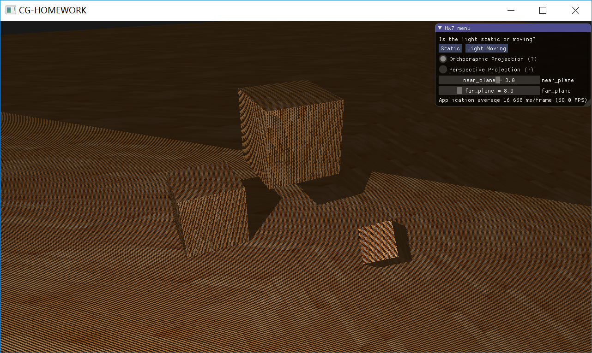

### 添加 GUI 以实现对阴影渲染的控制

> GUI 图如下：

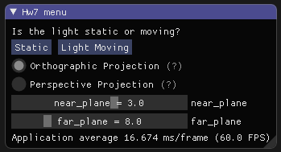

点击按钮可以选择是否让光源移动，此外还提供二选一勾选框以进行正交投影和透视投影之间的切换，这也即 `Bonus` 部分的投影切换，此外能对近平面远平面进行调整。

## Bonus

### 实现光源在正交/透视两种投影下的 Shadow Mapping

设置了一个变量 `ortho_or_persoect` 来标识投影类型

```c++
int ortho_or_perspect = 0;	// 0 -> ortho; 1 -> perspect
```

在 GUI 中可以通过二选一勾选该设置该变量的值

```c++
ImGui::RadioButton("Orthographic Projection", &ortho_or_perspect, 0);
ImGui::SameLine();
ShowHelpMarker("Tick to switch project mode to Orthographic Projection");
ImGui::RadioButton("Perspective Projection", &ortho_or_perspect, 1);
ImGui::SameLine();
ShowHelpMarker("Tick to switch project mode to Perspective Projection");
```

在渲染时，分别根据标识选择不同的投影

```c++
if (ortho_or_perspect == 0) 
			lightProjection = glm::ortho(-10.0f, 10.0f, -10.0f, 10.0f, near_plane, far_plane);
		else 
			lightProjection = glm::perspective(glm::radians(45.0f), (GLfloat)SHADOW_WIDTH / (GLfloat)SHADOW_HEIGHT, near_plane, far_plane);
```

### Shadow Mapping 优化

#### 使用阴影偏移来处理阴影失真

前面的图片中明显有不对的地方。放大看会发现明显的线条样式。我们可以看到地板四边形渲染出很大一块交替黑线。这种阴影贴图的不真实感叫做**阴影失真(Shadow Acne)**，下图解释了成因：


因为阴影贴图受限于解析度，在距离光源比较远的情况下，多个片元可能从深度贴图的同一个值中去采样。图片每个斜坡代表深度贴图一个单独的纹理像素。你可以看到，多个片元从同一个深度值进行采样。

虽然很多时候没问题，但是当光源以一个角度朝向表面的时候就会出问题，这种情况下深度贴图也是从一个角度下进行渲染的。多个片元就会从同一个斜坡的深度纹理像素中采样，有些在地板上面，有些在地板下面；这样我们所得到的阴影就有了差异。因为这个，有些片元被认为是在阴影之中，有些不在，由此产生了图片中的条纹样式。

我们可以用一个叫做**阴影偏移**（shadow bias）的技巧来解决这个问题，我们简单的对表面的深度（或深度贴图）应用一个偏移量，这样片元就不会被错误地认为在表面之下了。


使用了偏移量后，所有采样点都获得了比表面深度更小的深度值，这样整个表面就正确地被照亮，没有任何阴影。由于有些表面坡度很大，仍然会产生阴影失真。所以需要使用一个更加可靠的办法能够根据表面朝向光线的角度更改偏移量：片段法线和光线向量的点乘

```c++
float bias = max(0.05 * (1.0 - dot(normal, lightDir)), 0.005);
float shadow = currentDepth - bias > closestDepth ? 1.0 : 0.0;
```

使用阴影偏移之后，场景改进如下：

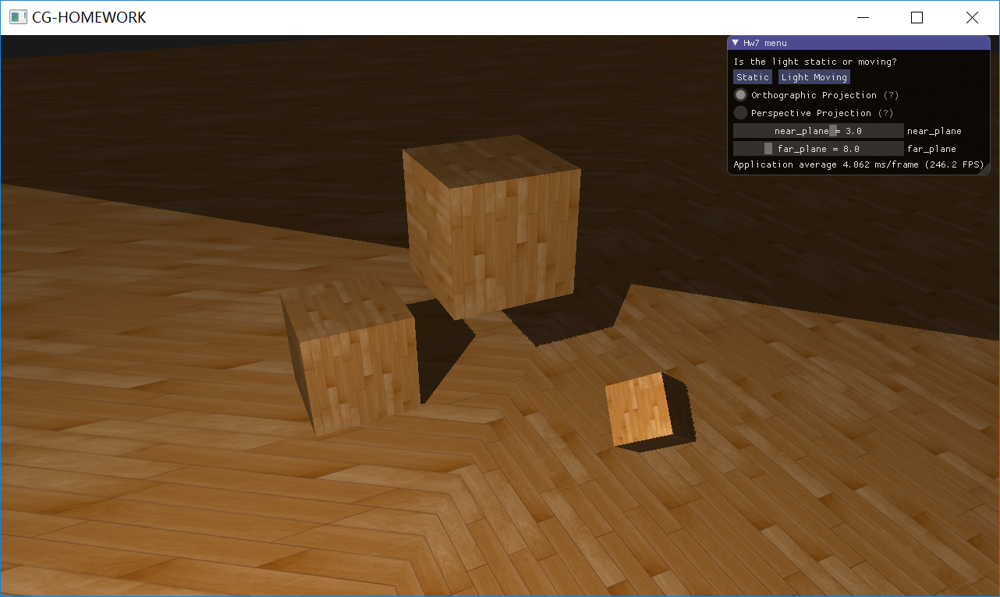

#### 调整近平面远平面间隔以减弱悬浮

在[LearnOpenGL CN 阴影映射]([https://learnopengl-cn.github.io/05%20Advanced%20Lighting/03%20Shadows/01%20Shadow%20Mapping/](https://learnopengl-cn.github.io/05 Advanced Lighting/03 Shadows/01 Shadow Mapping/))一文中，作者提出，在以光源视角渲染得到深度图这一过程中，使用正面剔除来代替 OpenGL 默认的背面剔除，能够有效地解决悬浮问题。

而我在思考后发现，**作者提出的这种方法非但不能有效解决悬浮问题，反而还会加剧悬浮问题！**

很直观地，从公式上就能看出这一点：

```c++
float shadow = currentDepth - bias > closestDepth ? 1.0 : 0.0;
```

无论在渲染深度贴图的时候使用正面剔除还是背面剔除，上面这行代码中的 `currentDepth` 和 `bias` 是保持不变的，`currentDepth` 取决于片段与光源点的距离，`bias` 取决于片段的法向量和光线向量的夹角余弦值。而 `closestDepth` 显然在使用正面剔除的时候要更大一点，好了：

`currentDepth` 和 `bias` 保持不变，而 `closestDepth` 变大，这不就等价于 `currentDepth` 和 `closestDepth` 不变（使用默认的背面剔除），然后减去一个更大的 `bias` 吗？也即和原来相比 `currentDepth` 要减去更多的 `bias`，这显然是会加剧 Peter panning 问题而不是解决。

在做实验中也能观察到这一点，我们通过在渲染场景前后进行面剔除的设置：渲染前使用正面剔除，渲染后重新设置回背面剔除：

```c++
glEnable(GL_CULL_FACE);
glCullFace(GL_FRONT);
renderScene(simpleDepthShader);
glCullFace(GL_BACK);
glDisable(GL_CULL_FACE);
```

现在可以来看看使用背面剔除和正面剔除的效果对比：

<table>
  <tr>
  	<td><center>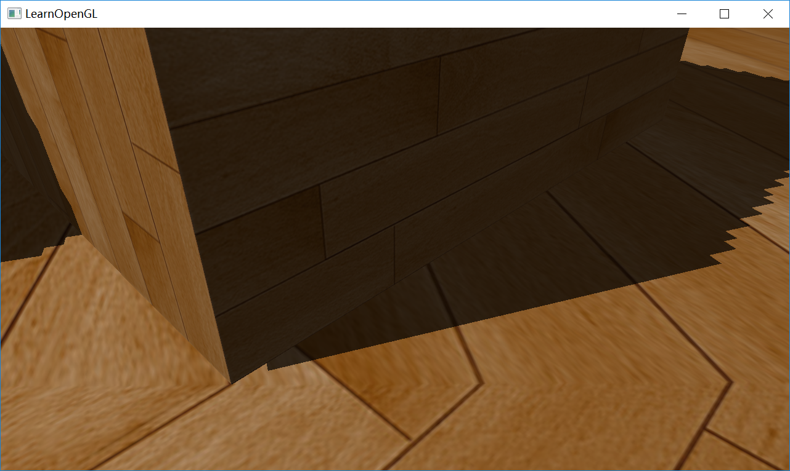</center><center>背面剔除（默认）<center></td>
    <td><center>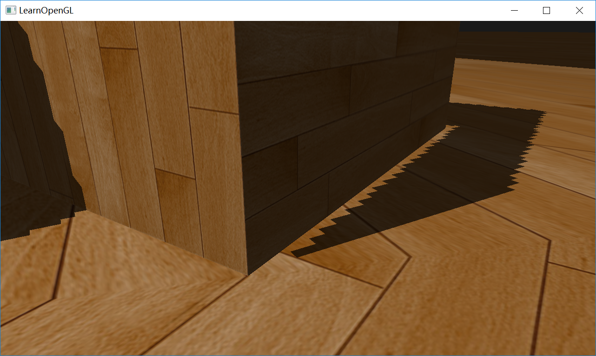</center><center>正面剔除</center></td>
  </tr>
</table>

明显地，使用正面剔除效果确实如预期般变差了！

那我们如何解决 Peter Panning 问题呢？实际上，**这个问题追根溯源还是因为阴影贴图受限于解析度，所以我们可以通过提高阴影贴图的精度来尽可能改善。一般的方法是，在设置光源投影矩阵的时候，把近平面和远平面设置地靠近一点**，深度纹理需要表达的范围小了，自然精度就上去了。

<table>
  <tr>
  	<td><center>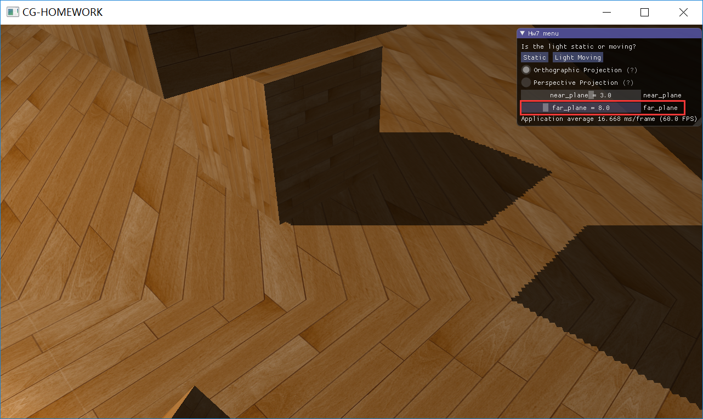</center><center>近平面: 3.0，远平面: 8.0<center></td>
    <td><center>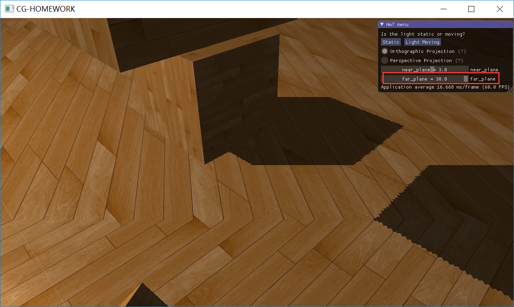</center><center>近平面: 3.0，远平面: 30.0</center></td>
  </tr>
</table>

#### 处理采样越界问题：采样过多

**光的视锥不可见的区域，我们是没有对其深度进行采样的，那么在贴图的时候，这些区域的表现就会出现问题。**一般来说，我们会遇到两种情况：

- 片段不在光的视锥体内，但片段夹在近平面和远平面之间。
- 片段不在光的视锥体内，片段落到远平面后面去了。

为解释方便，我们先列出计算 shadow 的函数 `ShadowCalculation`：

```c++
float ShadowCalculation(vec4 fragPosLightSpace, float bias)
{
	vec3 projCoords = fragPosLightSpace.xyz / fragPosLightSpace.w;
	projCoords = projCoords * 0.5 + 0.5;
	float closestDepth = texture(shadowMap, projCoords.xy).r;
	float currentDepth = projCoords.z;
	float shadow = currentDepth - bias > closestDepth ? 1.0 : 0.0;

	return shadow;
}
```

首先是第一种情况，符合这种情况的片段，其 `projCoords` 的 x 值和 y 值至少有一个是不在 NDC 之内的，也即超过了 [0, 1]。这也就意味着在对深度贴图进行采样时 `texture(shadowMap, projCoords.xy).r`，提供的纹理坐标是越界的，对于越界纹理坐标的处理，早在[纹理]([https://learnopengl-cn.github.io/01%20Getting%20started/06%20Textures/](https://learnopengl-cn.github.io/01 Getting started/06 Textures/))一章中就已经提到：

> 纹理坐标的范围通常是从(0, 0)到(1, 1)，那如果我们把纹理坐标设置在范围之外会发生什么？OpenGL默认的行为是重复这个纹理图像（我们基本上忽略浮点纹理坐标的整数部分），但OpenGL提供了更多的选择：
>
> | 环绕方式           | 描述                                                         |
> | :----------------- | :----------------------------------------------------------- |
> | GL_REPEAT          | 对纹理的默认行为。重复纹理图像。                             |
> | GL_MIRRORED_REPEAT | 和GL_REPEAT一样，但每次重复图片是镜像放置的。                |
> | GL_CLAMP_TO_EDGE   | 纹理坐标会被约束在0到1之间，超出的部分会重复纹理坐标的边缘，产生一种边缘被拉伸的效果。 |
> | GL_CLAMP_TO_BORDER | 超出的坐标为用户指定的边缘颜色。                             |

在我的实验中，我在开始把环绕方式设置为 `GL_REPEAT`，所以容易看到这样的现象（红色圈住部分）：

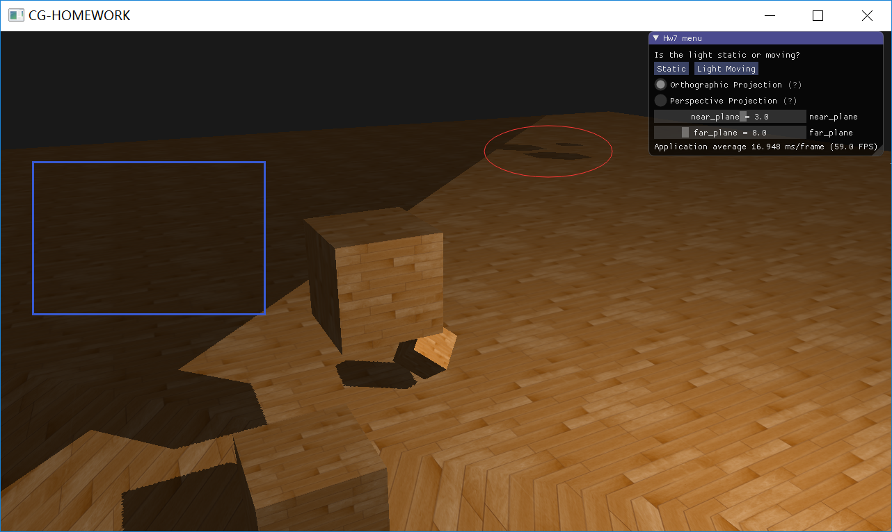

由于 `GL_REPEAT` 我们能够获得 `closestDepth`，然后因为第一种情况的片段其 z 值小于 1，对比地板的 `currentDepth` 发现在某些区域其值要比 `closestDepth` 要大，于是这种突兀的阴影就产生了。

对于这种现象的处理非常简单，将纹理环绕方式替换为 `GL_CLAMP_TO_BORDER`，将超出纹理坐标范围的所有片段给予其一个边界颜色而非进行重复：

```c++
glTexParameteri(GL_TEXTURE_2D, GL_TEXTURE_WRAP_S, GL_CLAMP_TO_BORDER);
glTexParameteri(GL_TEXTURE_2D, GL_TEXTURE_WRAP_T, GL_CLAMP_TO_BORDER);
GLfloat borderColor[] = { 1.0, 1.0, 1.0, 1.0 };
glTexParameterfv(GL_TEXTURE_2D, GL_TEXTURE_BORDER_COLOR, borderColor);
```

这样的话，如果 `projCoords` 超出范围，那么

```c++
float closestDepth = texture(shadowMap, projCoords.xy).r;
```

对 `shadowMap` 进行采样得到的将是 1.0，显然对于这些 z 值小于 1 的片段，其 `currentDepth` 必然比 `closestDepth` 小，故函数输出 `shadow` 为 0.0，也即不考虑阴影。效果图：

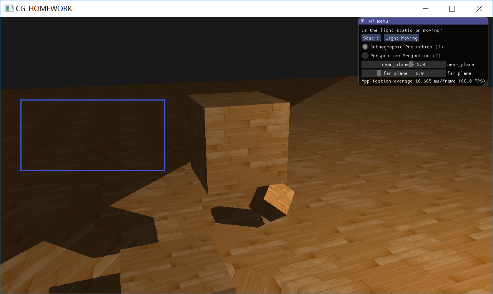

然后是第二种情况，可以看到上图中，还有一部分区域是带阴影的。这种区域之所以带阴影，最主要的原因在于，这些片段其在远平面的后面，所以其 z 值大于 1。不管 `cloestDepth` 采样到什么，其 z 值都是要比任何 `closestDepth` 大，所以函数输出 `shadow` 为 1.0，也即考虑阴影。

**对于这种情况，我们当然可以通过将远平面调远一点来解决，但是这样无疑会加重上文提到的悬浮现象**，更优的解决方案是：只要投影向量的z坐标大于1.0，我们就把shadow的值强制设为0.0。

```c++
float ShadowCalculation(vec4 fragPosLightSpace)
{
 [...]
 if(projCoords.z > 1.0)
     shadow = 0.0;

 return shadow;
}
```

处理后效果图如下：

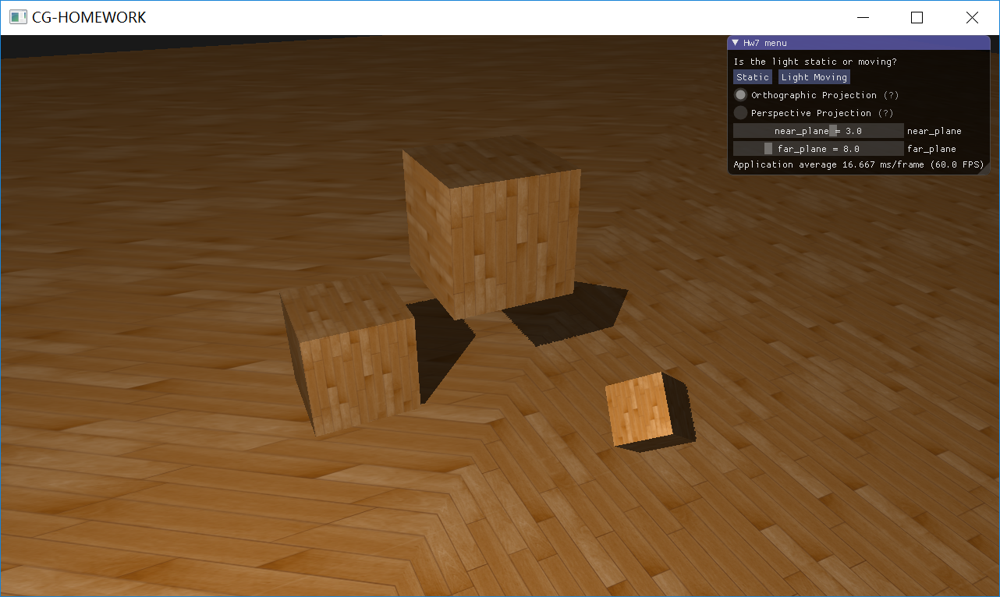

#### 阴影的抗锯齿

现在阴影已经较好地附着到场景中去了，但是如果放大看阴影，我们能够很明显地看到阴影的边缘是有严重的锯齿的。


因为深度贴图有一个固定的解析度，多个片元对应于一个纹理像素。结果就是多个片元会从深度贴图的同一个深度值进行采样，这几个片元便得到的是同一个阴影，这就会产生锯齿边。

你可以通过**增加深度贴图解析度**的方式来降低锯齿块，也可以尝试尽可能的**让光的视锥接近场景**，**这两种方法的原理都是尽可能提高阴影贴图的解析度！**

但事实上，尝试让光的视锥靠近场景并不是一个实用的做法，让光的视锥接近场景实际上带来了一个新的问题：我们不能处理整个大的场景，因为对于大的场景进行渲染，视锥体一靠近场景，那么场景就有一部分在光的视锥体之外了。

##### 增加深度贴图解析度

我们可以在创建 `depthMap` 的时候，将 `SHADOW_WIDTH` 和 `SHADOW_HEIGHT` 设置得大一点，`SHADOW_WIDTH x SHADOW_HEIGHT` 也即深度贴图的解析度。原来的 `depthMap` 其 `SHADOW_WIDTH x SHADOW_HEIGHT` 为 1280 x 1280，现在将其增加至 8000 x 8000：

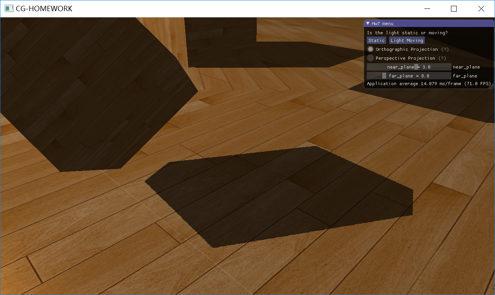

明显地，锯齿现象被很好的改善了！这样的方法很好，但是这种方法无疑需要花费大量的空间来存储解析度更大的深度贴图，这种存储空间的占用是平方级别的提升！

##### PCF

另一个（并不完整的）解决方案叫做PCF（percentage-closer filtering），核心思想是从深度贴图中多次采样，每一次采样的纹理坐标都稍有不同。每个独立的样本可能在也可能不再阴影中。所有的次生结果接着结合在一起，进行平均化，我们就得到了柔和阴影。

一个简单的PCF的实现是简单的从纹理像素四周对深度贴图采样，然后把结果平均起来：

```c++
float shadow = 0.0;
vec2 texelSize = 1.0 / textureSize(shadowMap, 0);
for(int x = -1; x <= 1; ++x)
{
    for(int y = -1; y <= 1; ++y)
    {
        float pcfDepth = texture(shadowMap, projCoords.xy + vec2(x, y) * texelSize).r; 
        shadow += currentDepth - bias > pcfDepth ? 1.0 : 0.0;        
    }    
}
shadow /= 9.0;
```

采用 PCF 方法优化之后的整体阴影显示为：

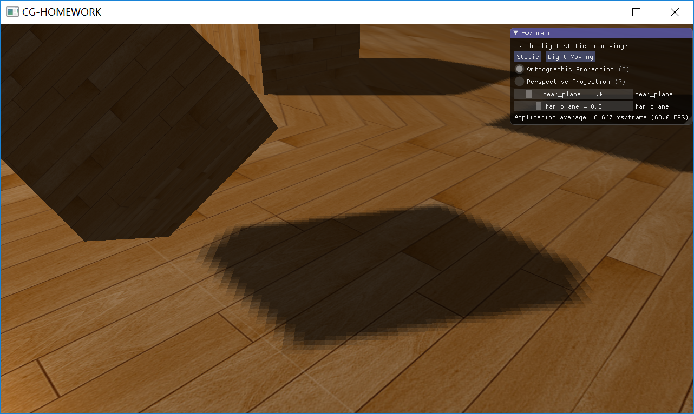

结果一系列优化（抗锯齿使用 PCF）以后，整个场景的阴影渲染效果如下：

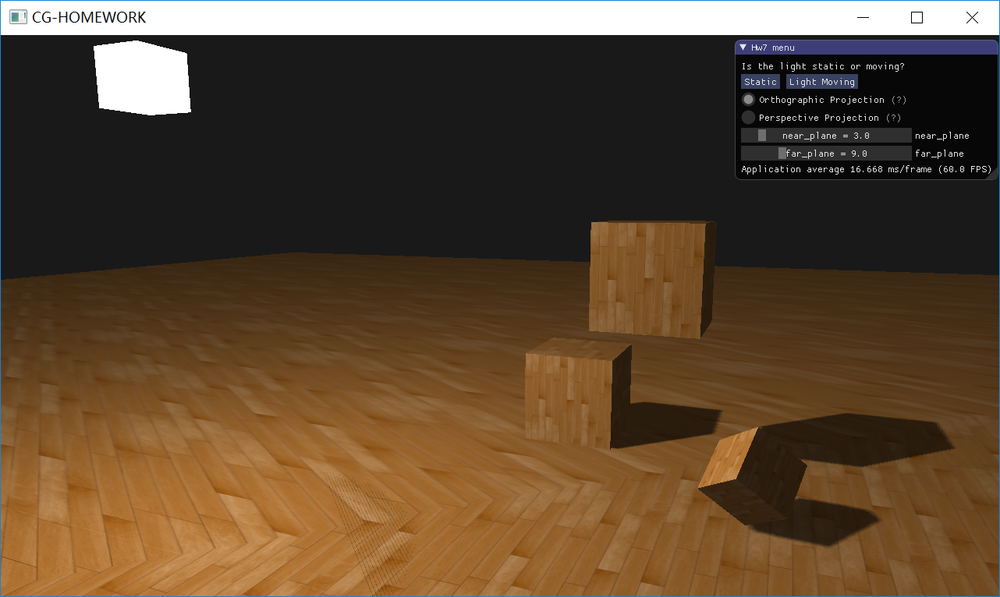