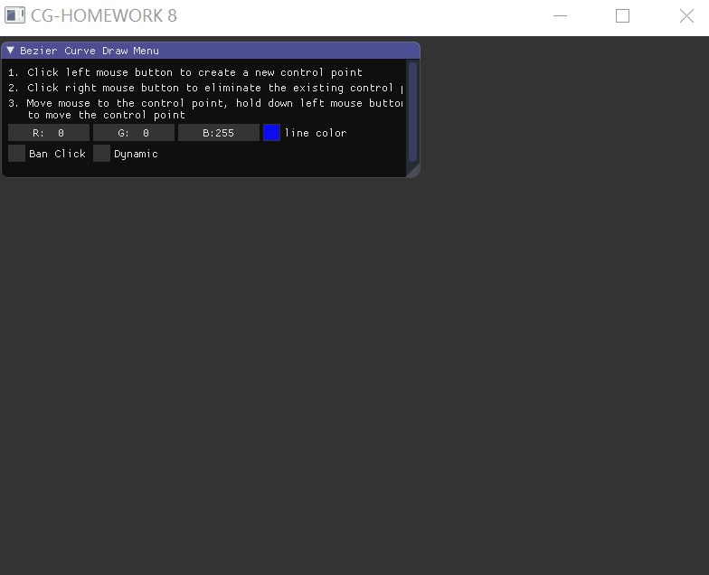
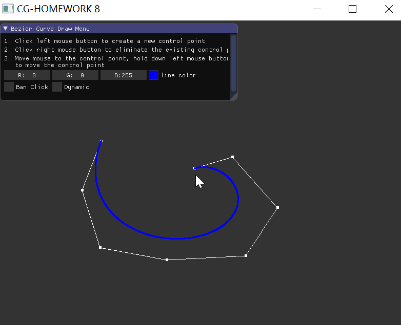
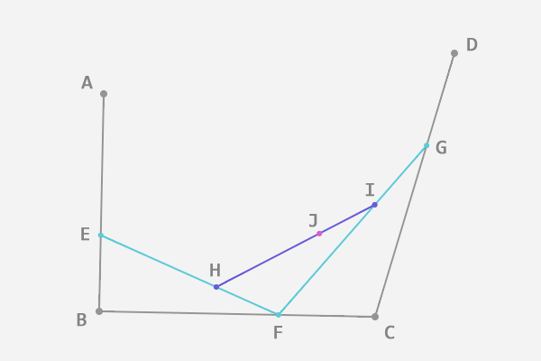

# Homework 8 - Bezier Curve

`16340237_吴聪_HW8_v0`

[TOC]

## 效果展示

> 详见 `doc/demo.gif`



## Basic

>1. 用户能通过左键点击添加 Bezier 曲线的控制点，右键点击则对当前添加的最后一个控制点进行消除 
>2. 工具根据鼠标绘制的控制点**实时**更新 Bezier 曲线 

### 添加控制点

定义一个 `vector<glm::vec2>` 的全局变量 `control_points`，用以保存所有的控制点的位置。

`mouse_button_callback` 为 GLFW 中监视鼠标输入的回调函数。按下鼠标左键则将当前位置 push_back 到 `control_points` 中。

```c++
void mouse_button_callback(GLFWwindow * window, int button, int action, int mode)
{
	double xpos, ypos;
	glfwGetCursorPos(window, &xpos, &ypos);
	cout << control_points.size() << endl;
	cout << xpos << ", " << ypos << endl;

	if (button == GLFW_MOUSE_BUTTON_LEFT)
	{
		// Add point to control_points
		if (action == GLFW_PRESS)
		{
			control_points.push_back(ndc_norm(glm::vec2(xpos, ypos)));
		}
	}
}
```

注意到，在将当前位置 push_back 到 `control_points` 之前，我们先使用了一个 `ndc_norm` 函数对坐标位置进行了标准化，将其转换到标准设备坐标系中去：

```c++
glm::vec2 ndc_norm(glm::vec2 scr_pos)
{
	glm::vec2 ret;
	ret.x = 2 * (scr_pos.x / SCR_WIDTH) - 1;
	ret.y = 1 - 2 * (scr_pos.y / SCR_HEIGHT);
	return ret;
}
```

现在点击屏幕，点击位置能够保存到全局的 `control_points` 中了。下一步的工作是根据 `control_points` 中的所有控制点位置来绘制相应地控制点以及控制点之间的连线，这些工作可以通过定义一个 `render_points_and_lines` 函数来实现：

```c++
// render points and the line between (P0,P1), (P1,P2), ..., (Pn-1,Pn)
GLuint pointVAO, pointVBO;
void render_points_and_lines(Shader &shader, const vector<glm::vec2> &points)
{
	if (pointVAO == 0)
	{
		glGenVertexArrays(1, &pointVAO);
		glGenBuffers(1, &pointVBO);
	}

	// draw point
	glBindVertexArray(pointVAO);
	glBindBuffer(GL_ARRAY_BUFFER, pointVBO);
	glBufferData(GL_ARRAY_BUFFER, 2 * points.size() * sizeof(GLfloat), points.data(), GL_STATIC_DRAW);
	glEnableVertexAttribArray(0);
	glVertexAttribPointer(0, 2, GL_FLOAT, GL_FALSE, 2 * sizeof(GLfloat), (void*)0);
	glBindBuffer(GL_ARRAY_BUFFER, 0);
	glBindVertexArray(0);

	shader.use();
	shader.setVec3("color", glm::vec3(1.0f, 1.0f, 1.0f));
	glBindVertexArray(pointVAO);
	glPointSize(5.0f);
	glDrawArrays(GL_POINTS, 0, points.size());

	// draw line
	glDrawArrays(GL_LINE_STRIP, 0, points.size());

	glBindBuffer(GL_ARRAY_BUFFER, 0);
	glBindVertexArray(0);
}
```

### 拖拽控制点

#### version 1

> 鼠标左键点击控制点，按住移动，直到**松开鼠标左键后**点的位置才变化

首先，在按下鼠标左键时，需要额外做一个逻辑判断：鼠标此时点击的位置附近是否存在一个控制点？

- 如果存在，那么说明本次操作应该选择这个已存在的控制点，并准备对其进行移动
- 如果不存在，那么说明本次操作应该创建一个新的控制点

故 `mouse_button_callback` 稍作变更如下：

```c++
void mouse_button_callback(GLFWwindow * window, int button, int action, int mode)
{
	double xpos, ypos;
	glfwGetCursorPos(window, &xpos, &ypos);
	glm::vec2 ndc_pos = ndc_norm(glm::vec2(xpos, ypos));
	

	if (button == GLFW_MOUSE_BUTTON_LEFT)
	{
		// Add point to control_points
		if (action == GLFW_PRESS)
		{
			// if no nearby point
			util_iterator = get_nearby_point(ndc_pos, 2e-3);
			if (util_iterator == control_points.end())
			{
				control_points.push_back(ndc_pos);
				util_iterator = control_points.end();
			}
		}

		if (action == GLFW_RELEASE)
		{
			if (util_iterator != control_points.end())
			{
				util_iterator->x = ndc_pos.x;
				util_iterator->y = ndc_pos.y;
			}
		}
	}
}
```

定义了 `vector<glm::vec2>::iterator` 类型的全局变量 `util_iterator` 来记录当前点击位置的最近控制点（如果有的话，没有则说明应该创建新的控制点），然后在松开鼠标的时候，对这个记录下来的最近控制点更新为当前松开鼠标后所处的位置。

获取点击位置的最近控制点的函数 `get_nearby_point` 如下：

```c++
vector<glm::vec2>::iterator get_nearby_point(glm::vec2 scr_pos, const float sensitivity)
{

	vector<glm::vec2>::iterator ret = control_points.end();
	float minDist = 5;

	glm::vec2 ndc_pos = ndc_norm(scr_pos);

	// lambda function getDist: calculate the euclidean distance of two 2-d point
	auto getDist = [scr_pos](const vector<glm::vec2>::iterator iter) -> float
	{
		return pow((scr_pos.x - iter->x), 2) + pow((scr_pos.y - iter->y), 2);
	};

	// find nearby point: the nearest one!
	for (auto iter = control_points.begin(); iter != control_points.end(); ++iter)
	{
		auto dist = getDist(iter);
		// in sensitivity range
		if (dist < sensitivity)
		{
			if (dist < minDist)
			{
				ret = iter;
				minDist = dist;
			}
		}
	}

	return ret;
}
```

#### version 2

> 鼠标点击控制点，按住移动，点的位置随着鼠标实时变化

[version 1](#version 1) 不错，但是点的位置不能随时变化，这就意味着在后续绘制贝塞尔曲线的时候，我们无法实时动态地调整曲线。

要点的位置能够实时变化，这就意味着我们不能再在 `mouse_button_callback` 中更新点了，该函数只在鼠标点击或者松开才调用一次。我们可以把点的更新放到 `processInput` 函数中去，这个函数处于渲染循环中，能够被不断地调用。

```c++
void processInput(GLFWwindow *window)
{
	double xpos, ypos;
	glfwGetCursorPos(window, &xpos, &ypos);
	glm::vec2 ndc_pos = ndc_norm(glm::vec2(xpos, ypos));

	if (isMouseLeftButtonPressed)
	{
		util_iterator = get_nearby_point(ndc_pos, 1);
		if (util_iterator != control_points.end())
		{
			util_iterator->x = ndc_pos.x;
			util_iterator->y = ndc_pos.y;
		}
	}

	...
}
```

在 `processInput` 中使用了一个全局变量 `isMouseLeftButtonPressed`，该变量标志当前鼠标左键是否处于按下且未松开的状态，该变量在原先的 `mouse_button_callback` 中设置：

```c++
void mouse_button_callback(GLFWwindow * window, int button, int action, int mode)
{
	double xpos, ypos;
	glfwGetCursorPos(window, &xpos, &ypos);
	glm::vec2 ndc_pos = ndc_norm(glm::vec2(xpos, ypos));

	if (button == GLFW_MOUSE_BUTTON_LEFT)
	{
		// Add point to control_points
		if (action == GLFW_PRESS)
		{
			// if no nearby point
			isMouseLeftButtonPressed = true;
			util_iterator = get_nearby_point(ndc_pos, 1e-4);
			if (util_iterator == control_points.end())
			{
				control_points.push_back(ndc_pos);
				util_iterator = control_points.end();
			}
		}

		if (action == GLFW_RELEASE)
		{
			isMouseLeftButtonPressed = false;
		}
	}
}
```

注意到，对于 `get_nearby_point` 而言：

- 在 `mouse_button_callback` 中使用了较小的敏感度 1e-4，确保我们能够创建相邻很近的控制点。
- 在 `processInput` 中使用了相当大的敏感度 1，实际上这里敏感度是越大越好的。这是因为 `GLFW` 获取到的鼠标位置和当前实际的鼠标位置实际上是有一点差别的，这一点在快速移动鼠标的时候表现的非常明显：点的位置有点跟不上鼠标光标。

### 消除控制点

作业要求鼠标右键点击对当前添加的最后一个控制点进行消除，这里作了扩展，消除鼠标选中的控制点，而不是只能消除最后一个控制点。

有了 `get_nearby_point` 函数，我们能够很方便地获取到当前鼠标位置附近的控制点的相应的迭代器，根据迭代器使用 erase 函数来删除 `control_points` 中的相应控制点。

```c++
void mouse_button_callback(GLFWwindow * window, int button, int action, int mode)
{
	double xpos, ypos;
	glfwGetCursorPos(window, &xpos, &ypos);
	glm::vec2 ndc_pos = ndc_norm(glm::vec2(xpos, ypos));
  
	...

	if (button == GLFW_MOUSE_BUTTON_RIGHT && action == GLFW_PRESS)
	{
		util_iterator = get_nearby_point(ndc_pos, 5e-3);
		if (util_iterator != control_points.end())
		{
			control_points.erase(util_iterator);
		}
	}
}
```

### 实时更新 Bezier 曲线

Bezier 曲线的原理就是以下两条公式：
$$
\begin{align}
Q(t)=\sum_{i=0}^{n}P_{i}B_{i,n}(t), \quad t\in[0,1]
\tag{1}
\end{align}
$$

$$
\begin{align}
B_{i,n}(t)=\frac{n!}{i!(n-1)!}t^{i}(1-t)^{n-i}, \quad i=0,1,\cdots,n
\tag{2}
\end{align}
$$

为了绘制 Bezier 曲线，我们需要计算阶乘的函数 `factorial` 和计算伯恩斯坦基的函数 `bernstein`：

```c++
int factorial(int n)
{
	if (n == 0 || n == 1) return 1;
	int ret = 1;
	for (int i = 1; i <= n; ++i)
	{
		ret *= i;
	}
	return ret;
}

float bernstein(int i, int n, float t)
{
	float ret = float(factorial(n)) / float(factorial(i) * factorial(n - i)) * pow(t, i) * pow(1 - t, n - i);
	return ret;
}
```

对于 n 阶的 Bezier 曲线，其在比例为 t 时的点，也即 $Q(t)$ 通过 `get_bezier_curve_point` 来获得。

```c++
glm::vec2 get_bezier_curve_point(int n, float t)
{
	
	glm::vec2 ret(0.0f);
	for (int i = 0; i <= n; ++i)
	{
		glm::vec2 P_i = control_points[i];
		float B_in = bernstein(i, n, t);
		ret += B_in * P_i;
	}

	return ret;
}
```

要获得 n 阶 Bezier 曲线上的所有点（实际上是大部分点，曲线上的点是无限的），我们需要分别将 t 设为不同的值，然后获得相应的 $Q(t)$，将其保存到 `vector<glm::vec2>` 的全局变量 `bezier_curve_points` 中。`bezier_curve_points` 保存了所有 Bezier 曲线上的点。我们通过 `get_bezier_curve` 函数来完成这些工作：

```c++
void get_bezier_curve(int ctrl_points_num)
{
  bezier_curve_points.clear();
	// draw bezier curve when more then 2 control points: 2 control points means 1 degree of bezier curve
	if (ctrl_points_num >= 2)
	{
		float step = 0.001;
		int points_num = (1 / 0.001);
		bezier_curve_points.resize(points_num);
		for (int i = 0; i < points_num; ++i)
		{
			float t = i * step;
			int n = ctrl_points_num - 1;
			bezier_curve_points[i] = get_bezier_curve_point(n, t);
		}
		
	}
}
```

现在已经有足够多的 Bezier 曲线上的点保存到全局的 `bezier_curve_points` 中了。下一步的工作是绘制所有这些点，这些工作可以通过定义一个 `render_bezier_curve` 函数来实现：

```c++
// render bezier curve (all points on the curve)
GLuint curveVAO, curveVBO;
void render_bezier_curve(Shader &shader, const vector<glm::vec2> &points, ImVec4 color)
{
	if (curveVAO == 0)
	{
		glGenVertexArrays(1, &curveVAO);
		glGenBuffers(1, &curveVBO);
	}

	// draw point
	glBindVertexArray(curveVAO);
	glBindBuffer(GL_ARRAY_BUFFER, curveVBO);
	glBufferData(GL_ARRAY_BUFFER, 2 * points.size() * sizeof(GLfloat), points.data(), GL_STATIC_DRAW);
	glEnableVertexAttribArray(0);
	glVertexAttribPointer(0, 2, GL_FLOAT, GL_FALSE, 2 * sizeof(GLfloat), (void*)0);
	glBindBuffer(GL_ARRAY_BUFFER, 0);
	glBindVertexArray(0);

	shader.use();
	shader.setVec3("color", glm::vec3(color.x, color.y, color.z));
	glBindVertexArray(curveVAO);
	glPointSize(3.0f);
	glDrawArrays(GL_POINTS, 0, points.size());

	glBindBuffer(GL_ARRAY_BUFFER, 0);
	glBindVertexArray(0);
}
```

在渲染循环中，先调用 `get_bezier_points` 将足够多的 Bezier 曲线上的点载入全局变量 `bezier_curve_points`，然后调用 `render_bezier_curve` 绘制，即可实现实时更新 Bezier 曲线。

```c++
while (!glfwWindowShouldClose(window))
	{
		// input
		// -----
		processInput(window);

  	...
      
		// render
		// ------
		glClearColor(0.2f, 0.2f, 0.2f, 1.0f);
		glClear(GL_COLOR_BUFFER_BIT);

		// render control points and its lines
		render_points_and_lines(shader, control_points);
		// generate bezier_curve
		get_bezier_curve(control_points.size());
		// render points on the bezier curve
		render_bezier_curve(shader, bezier_curve_points, line_color);

		// glfw: swap buffers and poll IO events (keys pressed/released, mouse moved etc.)
		// -------------------------------------------------------------------------------
		glfwSwapBuffers(window);
		glfwPollEvents();
	}
```

### 效果图



## Bonus

> 1. 可以动态地呈现 Bezier 曲线的生成过程 

### 动态呈现 Bezier 曲线生成过程

要动态呈现 Bezier 曲线的生成过程，我们需要获得所有线段上 t 比例位置的点，如下图所示：



上图中有 4 个控制点 A，B，C，D。在给定这四个控制点的情况下，图中的 E，F，G 点很容易获得，但是 H，I 点需要我们先给定 E，F，G点，J 点需要我们先给定 H，I 点。

我们可以递归地实现这些点以及这些点之间的线的绘制，这在 `draw_intermediate_points` 函数中实现。

```c++
// draw intermediate points iteratively
void draw_intermediate_points(Shader &shader, const vector<glm::vec2> &points, float t)
{
	if (points.size() == 1)
	{
		return;
	}
	vector<glm::vec2> next_points;
	next_points.resize(points.size() - 1);
	for (int i = 0; i < points.size() - 1; ++i)
	{
		float x = (1 - t) * points[i].x + t * points[i + 1].x;
		float y = (1 - t) * points[i].y + t * points[i + 1].y;
		next_points[i] = glm::vec2(x, y);
	}
	render_points_and_lines(shader, next_points);
	draw_intermediate_points(shader, next_points, t);
}
```

每一层递归我们调用一次 `render_points_and_lines`，最终所有线段上的 t 比例位置点及连线都被绘制出来了。

动态绘制无非也就是从 0 到 1 不断地递增 t (`dynamic_t`)，然后调用 `draw_intermediate_points`：

```c++
	float dynamic_t = 0.0f;

	// render loop
	// -----------
	while (!glfwWindowShouldClose(window))
	{

		// std::cout << camera.Position.x << ", " << camera.Position.y << ", " << camera.Position.z  << "|" << camera.Yaw << ", " << camera.Pitch << std::endl;

		// input
		// -----
		processInput(window);

		// render
		// ------
		glClearColor(0.2f, 0.2f, 0.2f, 1.0f);
		glClear(GL_COLOR_BUFFER_BIT);

    ...
		
		// render control points and its lines
		render_points_and_lines(shader, control_points);
		// generate bezier_curve
		get_bezier_curve(control_points.size());
		// render points on the bezier curve
		render_bezier_curve(shader, bezier_curve_points, line_color);

		if (isDynamicDraw)
		{
			if (dynamic_t <= 1.0f)
			{
				dynamic_t += 0.002f;
				draw_intermediate_points(shader, control_points, dynamic_t);
			}
		}
		else
		{
			dynamic_t = 0.0f;
		}

		...

		// glfw: swap buffers and poll IO events (keys pressed/released, mouse moved etc.)
		// -------------------------------------------------------------------------------
		glfwSwapBuffers(window);
		glfwPollEvents();
	}
```

键盘输入 D 键负责控制上面代码中 `isDynamicDraw` 的真假，从而控制动态绘制，为 GLFW 定义监视键盘输入的回调函数如下 `key_callback`：

```c++
void key_callback(GLFWwindow* window, int key, int scancode, int action, int mode)
{
  ...
    
	if (key == GLFW_KEY_D && action == GLFW_PRESS)
	{
		isDynamicDraw = !isDynamicDraw;
	}
}
```

### 效果图


